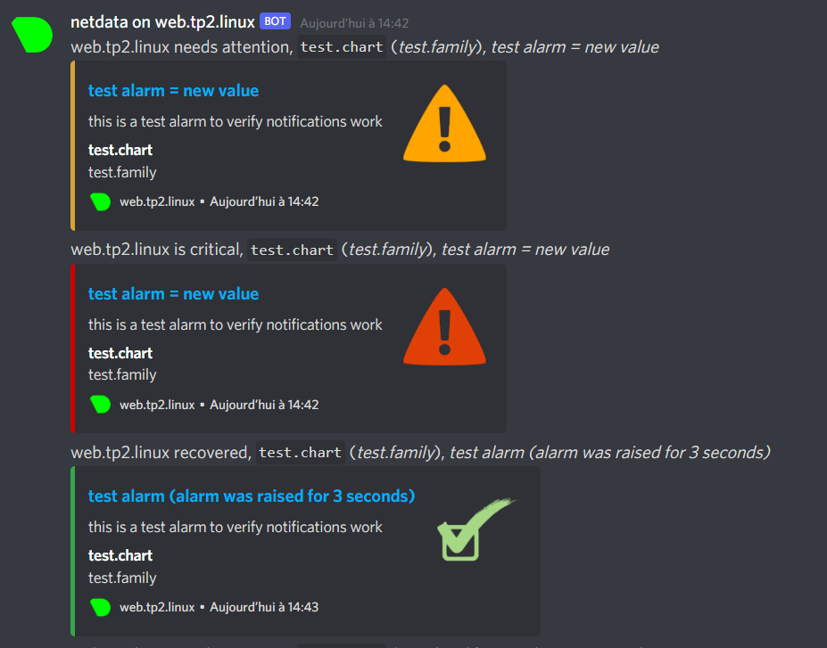
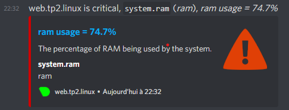

# TP2 pt. 2 : Maintien en condition opérationnelle


# Sommaire

- [TP2 pt. 2 : Maintien en condition opérationnelle](#tp2-pt-2--maintien-en-condition-opérationnelle)
- [Sommaire](#sommaire)
- [I. Monitoring](#i-monitoring)
  - [2. Setup](#2-setup)
- [II. Backup](#ii-backup)
  - [1. Intwo bwo](#1-intwo-bwo)
  - [2. Partage NFS](#2-partage-nfs)
  - [3. Backup de fichiers](#3-backup-de-fichiers)
  - [4. Unité de service](#4-unité-de-service)
    - [A. Unité de service](#a-unité-de-service)
    - [B. Timer](#b-timer)
    - [C. Contexte](#c-contexte)
  - [5. Backup de base de données](#5-backup-de-base-de-données)
  - [6. Petit point sur la backup](#6-petit-point-sur-la-backup)
- [III. Reverse Proxy](#iii-reverse-proxy)
  - [1. Introooooo](#1-introooooo)
  - [2. Setup simple](#2-setup-simple)
  - [3. Bonus HTTPS](#3-bonus-https)
- [IV. Firewalling](#iv-firewalling)
  - [1. Présentation de la syntaxe](#1-présentation-de-la-syntaxe)
  - [2. Mise en place](#2-mise-en-place)
    - [A. Base de données](#a-base-de-données)
    - [B. Serveur Web](#b-serveur-web)
    - [C. Serveur de backup](#c-serveur-de-backup)
    - [D. Reverse Proxy](#d-reverse-proxy)
    - [E. Tableau récap](#e-tableau-récap)


## 2. Setup

🌞 **Setup Netdata**

```bash
# Passez en root pour cette opération
$ sudo su -

# Install de Netdata via le script officiel statique
$ bash <(curl -Ss https://my-netdata.io/kickstart-static64.sh)

# Quittez la session de root
$ exit
```

🌞 **Manipulation du *service* Netdata**
```bash
 # déterminer s'il est actif, et s'il est paramétré pour démarrer au boot de la machine
 # déterminer à l'aide d'une commande `ss` sur quel port Netdata écoute
## web.tp2.linux
[targa@web ~]$ sudo systemctl is-enabled netdata
enabled
[targa@web ~]$ systemctl is-active netdata
active
[targa@web ~]$ ss -alpnt | grep netdata
tcp   LISTEN 0      128                                                127.0.0.1:8125             0.0.0.0:*     users:(("netdata",pid=6882,fd=37))                                                                 
tcp   LISTEN 0      128                                                  0.0.0.0:19999            0.0.0.0:*     users:(("netdata",pid=6882,fd=5))                                                                  
tcp   LISTEN 0      128                                                    [::1]:8125                [::]:*     users:(("netdata",pid=6882,fd=36))                                                                 
tcp   LISTEN 0      128                                                     [::]:19999               [::]:*     users:(("netdata",pid=6882,fd=6))   

# autoriser ce port dans le firewall
## web.tp2.linux
[targa@web ~]$ sudo firewall-cmd --add-port=19999/tcp --permanent; sudo firewall-cmd --add-port=8125/tcp --permanent
success
[targa@web ~]$ sudo firewall-cmd --reload
success
[targa@web ~]$  sudo firewall-cmd --list-all
public (active)
  target: default
  icmp-block-inversion: no
  interfaces: enp0s3 enp0s8
  sources:
  services: ssh
  ports: 80/tcp 19999/tcp 8125/tcp
  protocols:
  masquerade: no
  forward-ports:
  source-ports:
  icmp-blocks:
  rich rules:


**Eeeeet.... c'est tout !**, rendez-vous sur `http://IP_VM:PORT` pour accéder à l'interface Web de Netdata (depuis un navigateur sur votre PC).  
**C'est sexy na ? Et c'est en temps réel :3**
```
🌞 **Setup Alerting**
- ajustez la conf de Netdata pour mettre en place des alertes Discord

```
[targa@web ~]$ sudo cat /opt/netdata/etc/netdata/health_alarm_notify.conf
[...]

# multiple recipients can be given like this:
#                  "CHANNEL1 CHANNEL2 ..."

# enable/disable sending discord notifications
SEND_DISCORD="YES"

# Create a webhook by following the official documentation -
# https://support.discordapp.com/hc/en-us/articles/228383668-Intro-to-Webhooks
DISCORD_WEBHOOK_URL="https://discord.com/api/webhooks/897135333852991569/MTvnE97wX6wDscbrFQW0HeImre4tpX0rZKFqjOF9kwWcnV--3Np1YOp92edYNmvIkmQz"

# if a role's recipients are not configured, a notification will be send to
# this discord channel (empty = do not send a notification for unconfigured
# roles):
DEFAULT_RECIPIENT_DISCORD="alarms"
```

```bash
# testez les alertes
## web.tp2.linux
[targa@web ~]$ sudo su -s /bin/bash netdata
bash-4.4$ export NETDATA_ALARM_NOTIFY_DEBUG=1
bash-4.4$ /opt/netdata/usr/libexec/netdata/plugins.d/alarm-notify.sh test

# SENDING TEST WARNING ALARM TO ROLE: sysadmin
2021-10-12 14:42:58: alarm-notify.sh: DEBUG: Loading config file '/opt/netdata/usr/lib/netdata/conf.d/health_alarm_notify.conf'...
2021-10-12 14:42:58: alarm-notify.sh: DEBUG: Loading config file '/opt/netdata/etc/netdata/health_alarm_notify.conf'...
[...]

bash-4.4$ /opt/netdata/usr/libexec/netdata/plugins.d/alarm-notify.sh test "ROLE"

# SENDING TEST WARNING ALARM TO ROLE: ROLE
2021-10-12 14:43:15: alarm-notify.sh: DEBUG: Loading config file '/opt/netdata/usr/lib/netdata/conf.d/health_alarm_notify.conf'...
2021-10-12 14:43:15: alarm-notify.sh: DEBUG: Loading config file '/opt/netdata/etc/netdata/health_alarm_notify.conf'...
2021-10-12 14:43:15: alarm-notify.sh: DEBUG: Cannot find sendmail command in the system path. Disabling email notifications.
[...]


```  


🌞 **Config alerting**

```bash
[targa@web ~]$ stress --vm-bytes $(awk '/MemAvailable/{printf "%d\n", $2 * 0.98;}' < /proc/meminfo)k --vm-keep -m 1
stress: info: [2550] dispatching hogs: 0 cpu, 0 io, 1 vm, 0 hdd

```


# II. Backup

| Machine            | IP            | Service                 | Port ouvert | IPs autorisées |
|--------------------|---------------|-------------------------|-------------|---------------|
| `web.tp2.linux`    | `10.102.1.11` | Serveur Web             | ?           | ?             |
| `db.tp2.linux`     | `10.102.1.12` | Serveur Base de Données | ?           | ?             |
| `backup.tp2.linux` | `10.102.1.13` | Serveur de Backup (NFS) | ?           | ?             |

🖥️ **VM `backup.tp2.linux`**

## 2. Partage NFS

🌞 **Setup environnement**

```bash
# créer un dossier `/srv/backup/`
# il contiendra un sous-dossier ppour chaque machine du parc
  # commencez donc par créer le dossier `/srv/backup/web.tp2.linux/`
# il existera un partage NFS pour chaque machine (principe du moindre privilège)
[targa@backup ~]$ sudo mkdir -p /srv/backup/web.tp2.linux/
[sudo] password for targa:
[targa@backup ~]$ sudo chown -R targa:targa /srv/backup/web.tp2.linux/
[targa@backup ~]$
```
🌞 **Setup partage NFS**

```
[targa@backup ~]$ sudo dnf install nfs-utils -y
Last metadata expiration check: 19:07:39 ago on Sat 23 Oct 2021 12:08:58 AM CEST.
[...]
[targa@backup ~]$ [targa@backup ~]$ sudo cat /etc/idmapd.conf | grep Domain
Domain = tp2.linux
[targa@backup ~]$ sudo cat /etc/exports
/srv/backup/web.tp2.linux 10.102.1.11/24(rw,no_root_squash)

[targa@backup ~]$ sudo firewall-cmd --add-service=nfs --permanent; sudo firewall-cmd --reload; sudo firewall-cmd --list-all
success
success
public (active)
  target: default
  icmp-block-inversion: no
  interfaces: enp0s3 enp0s8
  sources:
  services: nfs ssh
  ports:
  protocols:
  masquerade: no
  forward-ports:
  source-ports:
  icmp-blocks:
  rich rules:
[targa@backup ~]$ sudo systemctl enable --now rpcbind nfs-server
```

🌞 **Setup points de montage sur `web.tp2.linux`**


- monter le dossier `/srv/backups/web.tp2.linux` du serveur NFS dans le dossier `/srv/backup/` du serveur Web
```bash
[targa@web ~]$ sudo dnf -y install nfs-utils
[targa@web ~]$ sudo cat /etc/idmapd.conf | grep Domain
Domain = tp2.linux
[targa@web ~]$ sudo mkdir /srv/backup
[targa@web srv]$ sudo mount -t nfs backup.tp2.linux:/srv/backup/web.tp2.linux /srv/backup
```
- vérifier...
  - avec une commande `mount` que la partition est bien montée
  ```
  [targa@web srv]$ sudo mount | grep backup
  backup.tp2.linux:/srv/backup/web.tp2.linux on /srv/backup type nfs4 (rw,relatime,vers=4.2,rsize=131072,wsize=131072,namlen=255,hard,proto=tcp,timeo=600,retrans=2,sec=sys,clientaddr=10.102.1.11,local_lock=none,addr=10.102.1.13)
  
  ```
  - avec une commande `df -h` qu'il reste de la place
  ```
  [targa@web srv]$ sudo df -h | grep backup
  backup.tp2.linux:/srv/backup/web.tp2.linux  6.2G  2.0G  4.3G  32% /srv/backup
  ```
  - avec une commande `touch` que vous avez le droit d'écrire dans cette partition
  ```bash
  # Création d'un fichier `testttt` dans /srv/backup
  [targa@web backup]$ sudo touch /srv/backup/testt
  [targa@web backup]$ sudo ls -l /srv/backup/
  total 0
  -rw-r--r--. 1 root  root  0 Oct 23 19:52 testt
  # Il apparait bien dans le dossier /srv/backup/web.tp2.linux/ sur la machine backup
  [targa@backup ~]$ ls -l /srv/backup/web.tp2.linux/
  total 0
  -rw-r--r--. 1 root root 0 Oct 23 19:52 testt
  ```
- faites en sorte que cette partition se monte automatiquement grâce au fichier `/etc/fstab`
```bash
[targa@web ~]$ sudo vi /etc/fstab
[targa@web ~]$ sudo cat /etc/fstab | grep backup
backup.tp2.linux:/srv/backup/web.tp2.linux /srv/backup               nfs     defaults        0 0
# Test
[targa@web ~]$ sudo umount /srv/backup
[targa@web ~]$  sudo mount -av | grep /srv/backup
/srv/backup              : successfully mounted

```

🌟 **BONUS** : partitionnement avec LVM

- ajoutez un disque à la VM `backup.tp2.linux`
- utilisez LVM pour créer une nouvelle partition (5Go ça ira)
```bash
[targa@backup ~]$ lsblk
NAME        MAJ:MIN RM  SIZE RO TYPE MOUNTPOINT
sda           8:0    0    8G  0 disk
├─sda1        8:1    0    1G  0 part /boot
└─sda2        8:2    0    7G  0 part
  ├─rl-root 253:0    0  6.2G  0 lvm  /
  └─rl-swap 253:1    0  820M  0 lvm  [SWAP]
sdb           8:16   0    8G  0 disk
sr0          11:0    1 1024M  0 rom

## On crée un Physical Volume sur le disque qu'on a repéré
[targa@backup ~]$ sudo pvcreate /dev/sdb; sudo pvs
[sudo] password for targa:
  Physical volume "/dev/sdb" successfully created.
  PV         VG Fmt  Attr PSize  PFree
  /dev/sda2  rl lvm2 a--  <7.00g    0
  /dev/sdb      lvm2 ---   8.00g 8.00g

# On crée un Volume Group
[targa@backup ~]$ sudo vgcreate backup /dev/sdb; sudo vgs
  Volume group "backup" successfully created
  VG     #PV #LV #SN Attr   VSize  VFree
  backup   1   0   0 wz--n- <8.00g <8.00g
  rl       1   2   0 wz--n- <7.00g     0

# On crée un Logical Volume ( Logical Volume = Partition )
[targa@backup ~]$ sudo lvcreate -L 5G backup -n Backup
  Logical volume "Backup" created.
[targa@backup ~]$ sudo lvs
  LV     VG     Attr       LSize   Pool Origin Data%  Meta%  Move Log Cpy%Sync Convert
  Backup backup -wi-a-----   5.00g
  root   rl     -wi-ao----  <6.20g
  swap   rl     -wi-ao---- 820.00m

# Formater partition en ext4
[targa@backup ~]$ sudo mkfs -t ext4 /dev/mapper/backup-Backup
mke2fs 1.45.6 (20-Mar-2020)
Creating filesystem with 1310720 4k blocks and 327680 inodes
Filesystem UUID: 6088b1d7-eb8e-44d7-8b76-55b324c747a3
Superblock backups stored on blocks:
        32768, 98304, 163840, 229376, 294912, 819200, 884736

Allocating group tables: done
Writing inode tables: done
Creating journal (16384 blocks): done
Writing superblocks and filesystem accounting information: done

# Montage de la partition ( notre Lv ) sur /srv/backup
[targa@backup ~]$ sudo mount /dev/backup/Backup /srv/backup

# Vérifs :
[targa@backup ~]$ df -h | grep backup
/dev/mapper/backup-Backup  4.9G   20M  4.6G   1% /srv/backup
[targa@backup ~]$ lsblk | grep backup
└─backup-Backup 253:2    0    5G  0 lvm  /srv/backup
[targa@backup ~]$
```
- monter automatiquement cette partition au démarrage du système à l'aide du fichier `/etc/fstab`
- cette nouvelle partition devra être montée sur le dossier `/srv/backup/`

```bash
# Config
[targa@backup ~]$ sudo cat /etc/fstab | grep /dev/backup/Backup
/dev/backup/Backup /srv/backup ext4 defaults 0 0

# Vérif montage auto partition sur /srv/backup
[targa@backup ~]$ sudo umount /srv/backup
[targa@backup ~]$ sudo mount -av | grep /srv/backup
/srv/backup              : successfully mounted

# Vérif montage sur machine Web
[targa@web ~]$ sudo umount /srv/backup
[targa@web ~]$ sudo mount -av | grep /srv/backup
/srv/backup              : successfully mounted

# C'est bien notre partition de 5Go qui est utilisé pour le dossier /srv/backup
[targa@web ~]$ df -h | grep backup
backup.tp2.linux:/srv/backup/web.tp2.linux  4.9G   20M  4.6G   1% /srv/backup

[targa@backup ~]$ df -h | grep backup
/dev/mapper/backup-Backup  4.9G   20M  4.6G   1% /srv/backup

[targa@backup ~]$ lsblk | grep backup
└─backup-Backup 253:2    0    5G  0 lvm  /srv/backup

```

## 3. Backup de fichiers

**Un peu de scripting `bash` !** Le scripting est le meilleur ami de l'admin, vous allez pas y couper hihi.  

La syntaxe de `bash` est TRES particulière, mais ce que je vous demande de réaliser là est un script minimaliste.

Votre script **DEVRA**...

- comporter un shebang
- comporter un commentaire en en-tête qui indique le but du script, en quelques mots
- comporter un commentaire qui indique l'auteur et la date d'écriture du script

Par exemple :

```bash
#!/bin/bash
# Simple backup script
# it4 - 09/10/2021

...
```

🌞 **Rédiger le script de backup `/srv/tp2_backup.sh`**

- le script crée une archive compressée `.tar.gz` du dossier ciblé
  - cela se fait avec la commande `tar`
- l'archive générée doit s'appeler `tp2_backup_YYMMDD_HHMMSS.tar.gz`
  - vous remplacerez évidemment `YY` par l'année (`21`), `MM` par le mois (`10`), etc.
  - ces infos sont déterminées dynamiquement au moment où le script s'exécute à l'aide de la commande `date`
- le script utilise la commande `rsync` afin d'envoyer la sauvegarde dans le dossier de destination
- il **DOIT** pouvoir être appelé de la sorte :

```bash
$ ./tp2_backup.sh <DESTINATION> <DOSSIER_A_BACKUP>
```

📁 **Fichier `/srv/tp2_backup.sh`**

https://gitlab.com/EPEYRATAUD/b2-work-linux/-/blob/main/TP-2-part2/config/tp2_backup.sh

🌞 **Tester le bon fonctionnement**

- exécuter le script sur le dossier de votre choix
- prouvez que la backup s'est bien exécutée

```bash
  [targa@web srv]$ sudo ./tp2_backup.sh backup/ test/
  [OK] Archive /srv/tp2_backup_211024_145753.tar.gz created.
  [OK] Archive /srv/tp2_backup_211024_145753.tar.gz synchronized to backup/.
  [OK] Directory backup/ cleaned to keep only the 5 most recent backups.
  [targa@web backup]$ ls
  testt  tp2_backup_211024_145753.tar.gz
```
- **tester de restaurer les données**
  - récupérer l'archive générée, et vérifier son contenu
  ```
  [targa@web backup]$ tar xzfv tp2_backup_211024_145753.tar.gz
  test/
  test/tests_dir/
  ```
🌟 **BONUS**

- faites en sorte que votre script ne conserve que les 5 backups les plus récentes après le `rsync`
- faites en sorte qu'on puisse passer autant de dossier qu'on veut au script : `./tp2_backup.sh <DESTINATION> <DOSSIER1> <DOSSIER2> <DOSSIER3>...` et n'obtenir qu'une seule archive
- utiliser [Borg](https://borgbackup.readthedocs.io/en/stable/) plutôt que `rsync`

## 4. Unité de service

Lancer le script à la main c'est bien. **Le mettre dans une joulie *unité de service* et l'exécuter à intervalles réguliers, de manière automatisée, c'est mieux.**

Le but va être de créer un *service* systemd pour que vous puissiez interagir avec votre script de sauvegarde en faisant :

```bash
$ sudo systemctl start tp2_backup
$ sudo systemctl status tp2_backup
```

Ensuite on créera un *timer systemd* qui permettra de déclencher le lancement de ce *service* à intervalles réguliers.

**La classe nan ?**


---

### A. Unité de service

🌞 **Créer une *unité de service*** pour notre backup

- c'est juste un fichier texte hein
- doit se trouver dans le dossier `/etc/systemd/system/`
- doit s'appeler `tp2_backup.service`
- le contenu :

```bash
[targa@web ~]$ sudo cat /etc/systemd/system/tp2_backup.service

[Unit]
Description=Our own lil backup service (TP2)

[Service]
ExecStart=/srv/tp2_backup.sh /srv/backup /var/www/html
Type=oneshot
RemainAfterExit=no

[Install]
WantedBy=multi-user.target
```


🌞 **Tester le bon fonctionnement**
- Pas de suite, mon unité de service ne marche pas :(
# III. Reverse Proxy

## 2. Setup simple

| Machine            | IP            | Service                 | Port ouvert | IPs autorisées |
|--------------------|---------------|-------------------------|-------------|---------------|
| `web.tp2.linux`    | `10.102.1.11` | Serveur Web             | ?           | ?             |
| `db.tp2.linux`     | `10.102.1.12` | Serveur Base de Données | ?           | ?             |
| `backup.tp2.linux` | `10.102.1.13` | Serveur de Backup (NFS) | ?           | ?             |
| `front.tp2.linux`  | `10.102.1.14` | Reverse Proxy           | ?           | ?             |

🖥️ **VM `front.tp2.linux`**

**Déroulez la [📝**checklist**📝](#checklist) sur cette VM.**

🌞 **Installer NGINX**

```bash
# install des dépôts additionnels pour Rocky + Nginx
[targa@front ~]$ sudo dnf install -y epel-release
[targa@front ~]$ sudo dnf install -y nginx

```

🌞 **Tester !**

```
[targa@front ~]$ sudo systemctl start nginx.service
[targa@front ~]$ sudo systemctl enable nginx.service
Created symlink /etc/systemd/system/multi-user.target.wants/nginx.service → /usr/lib/systemd/system/nginx.service.
[targa@front ~]$ sudo ss -alpnt | grep nginx
LISTEN 0      128          0.0.0.0:80        0.0.0.0:*    users:(("nginx",pid=25845,fd=8),("nginx",pid=25844,fd=8))
LISTEN 0      128             [::]:80           [::]:*    users:(("nginx",pid=25845,fd=9),("nginx",pid=25844,fd=9))

[targa@front ~]$ sudo firewall-cmd --add-port=80/tcp --permanent
success
[targa@front ~]$  sudo firewall-cmd --list-all
public (active)
  target: default
  icmp-block-inversion: no
  interfaces: enp0s3 enp0s8
  sources:
  services: ssh
  ports: 80/tcp
  protocols:
  masquerade: no
  forward-ports:
  source-ports:
  icmp-blocks:
  rich rules:
```

🌞 **Explorer la conf par défaut de NGINX**

- repérez l'utilisateur qu'utilise NGINX par défaut

```
[targa@front nginx]$ sudo cat /etc/nginx/nginx.conf | grep user
user nginx;
```

- dans la conf NGINX, on utilise le mot-clé `server` pour ajouter un nouveau site
  - repérez le bloc `server {}` dans le fichier de conf principal
  ```bash
  server {
        listen       80 default_server;
        listen       [::]:80 default_server;
        server_name  _;
        root         /usr/share/nginx/html;

        # Load configuration files for the default server block.
        include /etc/nginx/default.d/*.conf;

        location / {
        }

        error_page 404 /404.html;
            location = /40x.html {
        }

        error_page 500 502 503 504 /50x.html;
            location = /50x.html {
        }
    }
  ```

- par défaut, le fichier de conf principal inclut d'autres fichiers de conf
  - mettez en évidence ces lignes d'inclusion dans le fichier de conf principal
  ```
  include /usr/share/nginx/modules/*.conf;
  include             /etc/nginx/mime.types;
  include /etc/nginx/conf.d/*.conf;

  include /etc/nginx/default.d/*.conf;

  ```

🌞 **Modifier la conf de NGINX**

- pour que ça fonctionne, le fichier `/etc/hosts` de la machine **DOIT** être rempli correctement, 
conformément à la **[📝**checklist**📝](#checklist)**
```
[targa@front etc]$ [targa@front etc]$ cat /etc/hosts
127.0.0.1   localhost localhost.localdomain localhost4 localhost4.localdomain4
::1         localhost localhost.localdomain localhost6 localhost6.localdomain6

10.102.1.11 web.tp2.linux web
10.102.1.12 db.tp2.linux db
10.102.1.13 backup.tp2.linux backup
10.102.1.14 front.tp2.linux front
```

- Après suppression du bloc server, création du fichier : `/etc/nginx/conf.d/web.tp2.linux.conf`

```bash
[targa@front etc]$ sudo cat /etc/nginx/conf.d/web.tp2.linux.conf


server {
    # on demande à NGINX d'écouter sur le port 80 pour notre NextCloud
    listen 80;
    # ici, c'est le nom de domaine utilisé pour joindre l'applicatio
    # ce n'est pas le nom du reverse proxy, mais le nom que les clients devront saisir pour atteindre le site
    server_name web.tp2.linux; # ici, c'est le nom de domaine utilisé pour joindre l'application (pas forcéme

    # on définit un comportement quand la personne visite la racine du site (http://web.tp2.linux/)
    location / {
    # on renvoie tout le trafic vers la machine web.tp2.linux
    proxy_pass http://web.tp2.linux;
    }
 }
```

## 3. Bonus HTTPS

**Etape bonus** : mettre en place du chiffrement pour que nos clients accèdent au site de façon plus sécurisée.

🌟 **Générer la clé et le certificat pour le chiffrement**

- il existe plein de façons de faire
- nous allons générer en une commande la clé et le certificat
- puis placer la clé et le cert dans les endroits standards pour la distribution Rocky Linux

```bash
# On se déplace dans un dossier où on peut écrire
$ cd ~

# Génération de la clé et du certificat
# Attention à bien saisir le nom du site pour le "Common Name"
$ openssl req -new -newkey rsa:2048 -days 365 -nodes -x509 -keyout server.key -out server.crt
[...]
Common Name (eg, your name or your server\'s hostname) []:web.tp2.linux
[...]

# On déplace la clé et le certificat dans les dossiers standards sur Rocky
# En le renommant
$ sudo mv server.key /etc/pki/tls/private/web.tp2.linux.key
$ sudo mv server.crt /etc/pki/tls/certs/web.tp2.linux.crt

# Setup des permissions restrictives
$ sudo chown root:root /etc/pki/tls/private/web.tp2.linux.key
$ sudo chown root:root /etc/pki/tls/certs/web.tp2.linux.crt
$ sudo chmod 400 /etc/pki/tls/private/web.tp2.linux.key
$ sudo chmod 644 /etc/pki/tls/certs/web.tp2.linux.crt
```

🌟 **Modifier la conf de NGINX**

- inspirez-vous de ce que vous trouvez sur internet
- il n'y a que deux lignes à ajouter
  - une ligne pour préciser le chemin du certificat
  - une ligne pour préciser le chemin de la clé
- et une ligne à modifier
  - préciser qu'on écoute sur le port 443, avec du chiffrement
- n'oubliez pas d'ouvrir le port 443/tcp dans le firewall

🌟 **TEST**

- connectez-vous sur `https://web.tp2.linux` depuis votre PC
- petite avertissement de sécu : normal, on a signé nous-mêmes le certificat
  - vous pouvez donc "Accepter le risque" (le nom du bouton va changer suivant votre navigateur)
  - avec `curl` il faut ajouter l'option `-k` pour désactiver cette vérification

# IV. Firewalling


## 2. Mise en place

### A. Base de données

🌞 **Restreindre l'accès à la base de données `db.tp2.linux`**

```
[targa@db ~]$  sudo firewall-cmd  --set-default-zone=drop
[sudo] password for targa:
success
[targa@db ~]$ sudo firewall-cmd --zone=drop --add-interface=enp0s8
Warning: ZONE_ALREADY_SET: 'enp0s8' already bound to 'drop'
success
[targa@db ~]$ sudo firewall-cmd --new-zone=ssh --permanent
success
[targa@db ~]$ sudo firewall-cmd --zone=ssh --add-source=10.102.1.1/32 --permanent
success
[targa@db ~]$ sudo firewall-cmd --zone=ssh --add-port=22/tcp --permanent
```
```
[targa@db ~]$ sudo firewall-cmd --new-zone=db --permanent
success
[targa@db ~]$ sudo firewall-cmd --zone=db --add-source=10.102.1.11/32 --permanent
success
[targa@db ~]$ sudo firewall-cmd --zone=db --add-port=3306/tcp --permanent
success
```

🌞 **Montrez le résultat de votre conf avec une ou plusieurs commandes `firewall-cmd`**

```
[targa@db ~]$ sudo firewall-cmd --get-active-zones
drop
  interfaces: enp0s3 enp0s8
[targa@db ~]$ sudo firewall-cmd --reload
success
[targa@db ~]$ sudo firewall-cmd --get-active-zones
db
  sources: 10.102.1.11/32
drop
  interfaces: enp0s8 enp0s3
ssh
  sources: 10.102.1.1/32
[targa@db ~]$ sudo firewall-cmd --get-default-zone
[sudo] password for targa:
drop

[targa@db ~]$ sudo firewall-cmd --list-all --zone=db
db (active)
  target: default
  icmp-block-inversion: no
  interfaces:
  sources: 10.102.1.11/32
  services:
  ports: 3306/tcp
  protocols:
  masquerade: no
  forward-ports:
  source-ports:
  icmp-blocks:
  rich rules:

[targa@db ~]$ sudo firewall-cmd --list-all --zone=ssh
ssh (active)
  target: default
  icmp-block-inversion: no
  interfaces:
  sources: 10.102.1.1/32
  services:
  ports: 22/tcp
  protocols:
  masquerade: no
  forward-ports:
  source-ports:
  icmp-blocks:
  rich rules:

[targa@db ~]$ sudo firewall-cmd --list-all --zone=drop
drop (active)
  target: DROP
  icmp-block-inversion: no
  interfaces: enp0s3 enp0s8
  sources:
  services:
  ports:
  protocols:
  masquerade: no
  forward-ports:
  source-ports:
  icmp-blocks:
  rich rules:
```

### B. Serveur Web

🌞 **Restreindre l'accès au serveur Web `web.tp2.linux`**

- Accès limité par ssh à notre hote et mise en place du `drop` par défaut:

```
[targa@web srv]$ sudo firewall-cmd --set-default-zone=drop
[sudo] password for targa:
success
[targa@web srv]$ sudo firewall-cmd --zone=drop --add-interface=enp0s8 --permanent
The interface is under control of NetworkManager, setting zone to 'drop'.
success
[targa@web srv]$  sudo firewall-cmd --new-zone=ssh --permanent
success
[targa@web srv]$ sudo firewall-cmd --zone=ssh --add-source=10.102.1.1/32 --permanent
success
[targa@web srv]$ sudo firewall-cmd --zone=ssh --add-port=22/tcp --permanent
success
```
- Accès limité au `front.tp2.linux`
```
[targa@web srv]$ sudo firewall-cmd --new-zone=web --permanent
success
[targa@web srv]$  sudo firewall-cmd --zone=web --add-source=10.102.1.14/32 --permanent
success
[targa@web srv]$ sudo firewall-cmd --zone=web --add-port=80/tcp --permanent
success
```

- Démonstration du bon fonctionnement

```
[targa@web srv]$  sudo firewall-cmd --get-active-zones
drop
  interfaces: enp0s8 enp0s3
ssh
  sources: 10.102.1.1/32
web
  sources: 10.102.1.14/32

[targa@web srv]$  sudo firewall-cmd --get-default-zone
drop

[targa@web srv]$  sudo firewall-cmd --list-all --zone=web
web (active)
  target: default
  icmp-block-inversion: no
  interfaces:
  sources: 10.102.1.14/32
  services:
  ports: 80/tcp
  protocols:
  masquerade: no
  forward-ports:
  source-ports:
  icmp-blocks:
  rich rules:

[targa@web srv]$ sudo firewall-cmd --list-all --zone=ssh
ssh (active)
  target: default
  icmp-block-inversion: no
  interfaces:
  sources: 10.102.1.1/32
  services:
  ports: 22/tcp
  protocols:
  masquerade: no
  forward-ports:
  source-ports:
  icmp-blocks:
  rich rules:

[targa@web srv]$ sudo firewall-cmd --list-all --zone=drop
drop (active)
  target: DROP
  icmp-block-inversion: no
  interfaces: enp0s3 enp0s8
  sources:
  services:
  ports:
  protocols:
  masquerade: no
  forward-ports:
  source-ports:
  icmp-blocks:
  rich rules:
```


🌞 **Montrez le résultat de votre conf avec une ou plusieurs commandes `firewall-cmd`**

### C. Serveur de backup

🌞 **Restreindre l'accès au serveur de backup `backup.tp2.linux`**

- drop par défaut 
```
[targa@backup ~]$ sudo firewall-cmd --set-default-zone=drop
[sudo] password for targa:
success
[targa@backup ~]$ sudo firewall-cmd --zone=drop --add-interface=enp0s8 --permanent
The interface is under control of NetworkManager, setting zone to 'drop'.
success
```
- Accès limité par `ssh`
```
[targa@backup ~]$ sudo firewall-cmd --new-zone=ssh --permanent
success
[targa@backup ~]$ sudo firewall-cmd --zone=ssh --add-source=10.102.1.1/32 --permanent
success
[targa@backup ~]$ sudo firewall-cmd --zone=ssh --add-port=22/tcp --permanent
success
```

- Accès limité aux machines qui utilisent le service `nfs` 
```
[targa@backup ~]$ sudo firewall-cmd --new-zone=nfs --permanent
success
[targa@backup ~]$ sudo firewall-cmd --zone=nfs --add-source=10.102.1.11/32 --permanent
success
[targa@backup ~]$ sudo firewall-cmd --zone=nfs --add-source=10.102.1.12/32 --permanent
success
[targa@backup ~]$ sudo firewall-cmd --zone=nfs --add-port=19999/tcp --permanent
success
[targa@backup ~]$ sudo firewall-cmd --zone=nfs --add-service=nfs --permanent
success
```


🌞 **Montrez le résultat de votre conf avec une ou plusieurs commandes `firewall-cmd`**
- Démonstration

```
[targa@backup ~]$ sudo firewall-cmd --get-active-zones
drop
  interfaces: enp0s8 enp0s3
nfs
  sources: 10.102.1.11/32 10.102.1.12/32
ssh
  sources: 10.102.1.1/32

[targa@backup ~]$ sudo firewall-cmd --get-default-zone
drop

[targa@backup ~]$ sudo firewall-cmd --list-all --zone=ssh
ssh (active)
  target: default
  icmp-block-inversion: no
  interfaces:
  sources: 10.102.1.1/32
  services:
  ports: 22/tcp
  protocols:
  masquerade: no
  forward-ports:
  source-ports:
  icmp-blocks:
  rich rules:

[targa@backup ~]$ sudo firewall-cmd --list-all --zone=nfs
nfs (active)
  target: default
  icmp-block-inversion: no
  interfaces:
  sources: 10.102.1.11/32 10.102.1.12/32
  services: nfs
  ports: 19999/tcp
  protocols:
  masquerade: no
  forward-ports:
  source-ports:
  icmp-blocks:
  rich rules:

[targa@backup ~]$ sudo firewall-cmd --list-all --zone=drop
drop (active)
  target: DROP
  icmp-block-inversion: no
  interfaces: enp0s3 enp0s8
  sources:
  services:
  ports:
  protocols:
  masquerade: no
  forward-ports:
  source-ports:
  icmp-blocks:
  rich rules:
```

### D. Reverse Proxy

🌞 **Restreindre l'accès au reverse proxy `front.tp2.linux`**

- drop par défaut 
```
[targa@front nginx]$ sudo firewall-cmd --set-default-zone=drop
[sudo] password for targa:
success
[targa@front nginx]$  sudo firewall-cmd --zone=drop --permanent --add-interface=enp0s8
The interface is under control of NetworkManager, setting zone to 'drop'.
success
```
-  Accès limité par `ssh`

```
[targa@front nginx]$ sudo firewall-cmd --permanent --new-zone=ssh
success
[targa@front nginx]$ sudo firewall-cmd --zone=ssh --add-source=10.102.1.1/32 --permanent
success
[targa@front nginx]$ sudo firewall-cmd --zone=ssh --add-port=22/tcp --permanent
success
```

- Accès limité pour tout les réseaux 

```
[targa@front nginx]$ sudo firewall-cmd --new-zone=proxy --permanent
success
[targa@front nginx]$ sudo firewall-cmd --zone=proxy --add-source=10.102.1.0/24 --permanent
success
[targa@front nginx]$ sudo firewall-cmd --reload
success
```


🌞 **Montrez le résultat de votre conf avec une ou plusieurs commandes `firewall-cmd`**

- Démonstration
```
[targa@front nginx]$ sudo firewall-cmd --get-active-zones
drop
  interfaces: enp0s8 enp0s3
proxy
  sources: 10.102.1.0/24
ssh
  sources: 10.102.1.1/32

[targa@front nginx]$ sudo firewall-cmd --get-default-zone
drop

[targa@front nginx]$ sudo firewall-cmd --list-all --zone=drop
drop (active)
  target: DROP
  icmp-block-inversion: no
  interfaces: enp0s3 enp0s8
  sources:
  services:
  ports:
  protocols:
  masquerade: no
  forward-ports:
  source-ports:
  icmp-blocks:
  rich rules:

[targa@front nginx]$ sudo firewall-cmd --list-all --zone=ssh
ssh (active)
  target: default
  icmp-block-inversion: no
  interfaces:
  sources: 10.102.1.1/32
  services:
  ports: 22/tcp
  protocols:
  masquerade: no
  forward-ports:
  source-ports:
  icmp-blocks:
  rich rules:

[targa@front nginx]$  sudo firewall-cmd --list-all --zone=proxy
proxy (active)
  target: default
  icmp-block-inversion: no
  interfaces:
  sources: 10.102.1.0/24
  services:
  ports:
  protocols:
  masquerade: no
  forward-ports:
  source-ports:
  icmp-blocks:
  rich rules:
```


### E. Tableau récap

🌞 **Rendez-moi le tableau suivant, correctement rempli :**

| Machine            | IP            | Service                 | Port ouvert | IPs autorisées |
|--------------------|---------------|-------------------------|-------------|---------------|
| `web.tp2.linux`    | `10.102.1.11` | Serveur Web             | 80           | 10.102.1.14             |
| `db.tp2.linux`     | `10.102.1.12` | Serveur Base de Données | 3306         | 10.102.1.11|
| `backup.tp2.linux` | `10.102.1.13` | Serveur de Backup (NFS) | 19999        | 1.102.1.11 / 10.102.1.12       |
| `front.tp2.linux`  | `10.102.1.14` | Reverse Proxy           | 443          | 10.102.1.1 à 10.102.1.254             |
