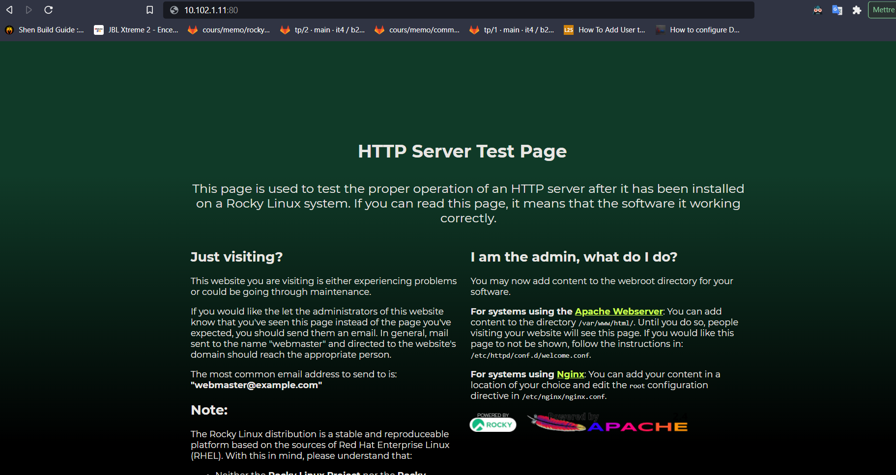
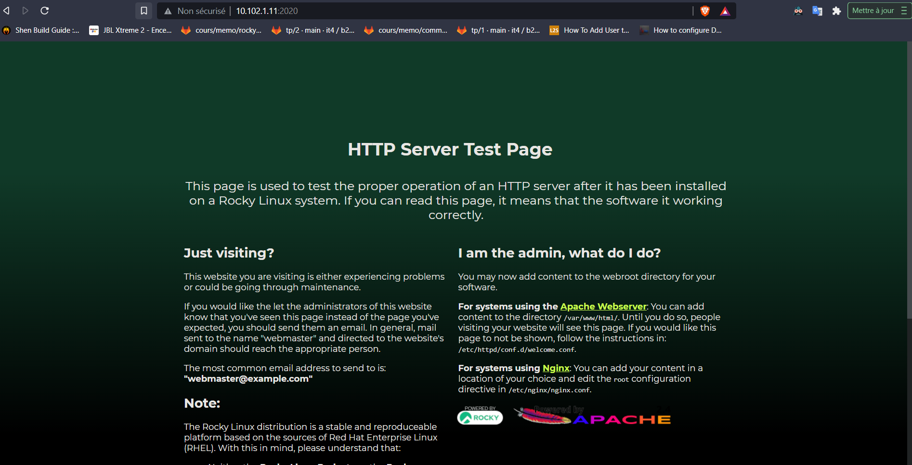
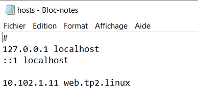

# TP2 pt. 1 : Gestion de service

Dans ce TP on va s'orienter sur l'**utilisation des systèmes GNU/Linux** comme un outil pour **faire tourner des services**. C'est le principal travail de l'administrateur système : fournir des services.

Ces services, on fait toujours la même chose avec :

- **installation** (opération ponctuelle)
- **configuration** (opération ponctuelle)
- **maintien en condition opérationnelle** (opération continue, tant que le service est actif)

**Dans cette première partie, on va voir la partie installation et configuration.** Peu importe l'outil visé, de la base de données au serveur cache, en passant par le serveur web, le serveur mail, le serveur DNS, ou le serveur privé de ton meilleur jeu en ligne, c'est toujours pareil : install into conf.

La partie maintien en condition opérationnelle sera abordée dans la deuxième partie de ce TP.

**On va apprendre à maîtriser un peu ces étapes, et pas simplement suivre la doc.**

On va maîtriser le service fourni :

- manipulation du service avec systemd
- quel IP et quel port il utilise
- quels utilisateurs du système sont mobilisés
- quels processus sont actifs sur la machine pour que le service soit actif
- gestion des fichiers qui concernent le service et des permissions associées
- gestion avancée de la configuration du service

# Sommaire

- [TP2 pt. 1 : Gestion de service](#tp2-pt-1--gestion-de-service)
- [Sommaire](#sommaire)
- [I. Un premier serveur web](#i-un-premier-serveur-web)
  - [1. Installation](#1-installation)
  - [2. Avancer vers la maîtrise du service](#2-avancer-vers-la-maîtrise-du-service)
- [II. Une stack web plus avancée](#ii-une-stack-web-plus-avancée)
  - [2. Setup](#2-setup)
    - [A. Serveur Web et NextCloud](#a-serveur-web-et-nextcloud)
    - [B. Base de données](#b-base-de-données)
    - [C. Finaliser l'installation de NextCloud](#c-finaliser-linstallation-de-nextcloud)


# I. Un premier serveur web

## 1. Installation

🖥️ **VM web.tp2.linux**

| Machine         | IP            | Service                 | Port ouvert | IP autorisées |
|-----------------|---------------|-------------------------|-------------|---------------|
| `web.tp2.linux` | `10.102.1.11` | Serveur Web             | ?           | ?             |

> Ce tableau devra figurer à la fin du rendu, avec les ? remplacés par la bonne valeur (un seul tableau à la fin). Je vous le remets à chaque fois, à des fins de clarté, pour lister les machines qu'on a à chaque instant du TP.

🌞 **Installer le serveur Apache**

- paquet `httpd`
```
[targa@web ~]$ sudo dnf install httpd
```

- le fichier de conf principal est `/etc/httpd/conf/httpd.conf`
```
[targa@web ~]$ sudo vim /etc/httpd/conf/httpd.conf
```
- virer les commentaire avec vim `:g/^ *#.*/d`
 afficher le fichier de conf plus tard 

🌞 **Démarrer le service Apache**

- démarrage du service `httpd`
```
[targa@web ~]$ sudo systemctl start httpd
```
-  démarrage automatique du service au démarrage de la machine
```
[targa@web ~]$ sudo systemctl enable httpd
Created symlink /etc/systemd/system/multi-user.target.wants/httpd.service → /usr/lib/systemd/system/httpd.service.
```
  - ouvrez le port firewall nécessaire
```
[targa@web ~]$ sudo firewall-cmd --add-port=80/tcp --permanent
success
```
- utilisation commande `ss` pour savoir sur quel port tourne actuellement Apache
```
[...]
LISTEN                0                     128                                              *:80                                              *:*                    users:(("httpd",pid=1491,fd=4),("httpd",pid=1490,fd=4),("httpd",pid=1489,fd=4),("httpd",pid=1487,fd=4))
``` 
- le port tcp 80 est bien utilisée par Apache .

🌞 **TEST**

- vérifier que le service est démarré et configuré pour démarrer automatiquement
```bash
[targa@web conf]$ sudo systemctl is-active httpd.service
active

[targa@web conf]$ sudo systemctl is-enabled httpd.service
enabled
```
- vérifier qu'il est configuré pour démarrer automatiquement dans `systemctl status httpd`
```
Loaded: loaded (/usr/lib/systemd/system/httpd.service; enabled; vendor preset: disabled)
```
- vérifier avec une commande `curl localhost` que vous joignez votre serveur web localement
```
[targa@web ~]$ curl localhost:80
<!doctype html>
<html>
  <head>
    <meta charset='utf-8'>
    <meta name='viewport' content='width=device-width, initial-scale=1'>
    <title>HTTP Server Test Page powered by: Rocky Linux</title>
    <style type="text/css">
      /*<![CDATA[*/
[...]
```
- vérifier avec votre navigateur (sur votre PC) que vous accéder à votre serveur web


## 2. Avancer vers la maîtrise du service

🌞 **Le service Apache...**

- donnez la commande qui permet d'activer le démarrage automatique d'Apache quand la machine s'allume
```
[targa@web ~]$ sudo systemctl enable httpd
```
- prouvez avec une commande qu'actuellement, le service est paramétré pour démarré quand la machine s'allume
```
[targa@web ~]$ sudo systemctl is-enabled httpd.service
enabled

```
- le service est paramétré pour démarré quand la machine s'allume
```
Loaded: loaded (/usr/lib/systemd/system/httpd.service; enabled; vendor preset: disabled)
```
- affichez le contenu du fichier `httpd.service` qui contient la définition du service Apache

```
[targa@web ~]$ sudo find /etc -name httpd.service
/etc/systemd/system/multi-user.target.wants/httpd.service
```
```
[targa@web ~]$ sudo cat /etc/systemd/system/multi-user.target.wants/httpd.service
[...]

[Unit]
Description=The Apache HTTP Server
Wants=httpd-init.service
After=network.target remote-fs.target nss-lookup.target httpd-init.service
Documentation=man:httpd.service(8)

[Service]
Type=notify
Environment=LANG=C

ExecStart=/usr/sbin/httpd $OPTIONS -DFOREGROUND
ExecReload=/usr/sbin/httpd $OPTIONS -k graceful
# Send SIGWINCH for graceful stop
KillSignal=SIGWINCH
KillMode=mixed
PrivateTmp=true

[Install]
WantedBy=multi-user.target
```

🌞 **Déterminer sous quel utilisateur tourne le processus Apache**

- mettez en évidence la ligne dans le fichier de conf qui définit quel user est utilisé
```
[targa@web ~]$ sudo cat /etc/httpd/conf/httpd.conf

ServerRoot "/etc/httpd"

Listen 80

Include conf.modules.d/*.conf

User apache
Group apache
```
- utilisez la commande `ps -ef` pour visualiser les processus en cours d'exécution et confirmer que apache tourne bien sous l'utilisateur mentionné dans le fichier de conf
```
[targa@web ~]$ ps -ef
[...]
apache      1853    1851  0 17:31 ?        00:00:00 /usr/sbin/httpd -DFOREGROUND
apache      1854    1851  0 17:31 ?        00:00:00 /usr/sbin/httpd -DFOREGROUND
apache      1855    1851  0 17:31 ?        00:00:00 /usr/sbin/httpd -DFOREGROUND
apache      1856    1851  0 17:31 ?        00:00:00 /usr/sbin/httpd -DFOREGROUND
```
- vérifiez avec un `ls -al` le dossier du site (dans `/var/www/...`) 
  - vérifiez que tout son contenu appartient à l'utilisateur mentionné dans le fichier de conf

🌞 **Changer l'utilisateur utilisé par Apache**

- créez le nouvel utilisateur
```
[targa@web ~]$ sudo useradd apache2 -b /usr/share/httpd/ -s /sbin/nologin
[targa@web ~]$ sudo usermod -aG apache apache2
```
- modifiez la configuration d'Apache pour qu'il utilise ce nouvel utilisateur
```
[targa@web ~]$ sudo cat /etc/httpd/conf/httpd.conf

ServerRoot "/etc/httpd"

Listen 80

Include conf.modules.d/*.conf

User apache2
Group apache
```
- redémarrez Apache
```
[targa@web ~]$ systemctl restart httpd
```
- utilisez une commande `ps` pour vérifier que le changement a pris effet
```
[targa@web ~]$ ps -ef
[...]
apache2     2334    2333  0 12:20 ?        00:00:00 /usr/sbin/httpd -DFOREGROUND
apache2     2335    2333  0 12:20 ?        00:00:00 /usr/sbin/httpd -DFOREGROUND
apache2     2336    2333  0 12:20 ?        00:00:00 /usr/sbin/httpd -DFOREGROUND
apache2     2337    2333  0 12:20 ?        00:00:00 /usr/sbin/httpd -DFOREGROUND
[...]
```


🌞 **Faites en sorte que Apache tourne sur un autre port**

- modifiez la configuration d'Apache pour lui demande d'écouter sur un autre port
```
[targa@web ~]$ sudo vim /etc/httpd/conf/httpd.conf
[targa@web ~]$ sudo cat /etc/httpd/conf/httpd.conf | grep Listen
Listen 2020
```
- ouvrez un nouveau port firewall, et fermez l'ancien
```
[targa@web ~]$ sudo firewall-cmd --remove-port=80/tcp --permanent
[targa@web ~]$ sudo firewall-cmd --reload
[targa@web ~]$ sudo firewall-cmd --add-port=2020/tcp --permanent
```
- redémarrez Apache
```
[targa@web ~]$ sudo firewall-cmd --reload
```
- prouvez avec une commande `ss` que Apache tourne bien sur le nouveau port choisi
```
[targa@web ~]$ ss -alpnt
State                    Recv-Q                   Send-Q                                     Local Address:Port                                      Peer Address:Port                   Process
[...]
LISTEN                   0                        128                                                    *:2020                                                 *:*
[...]
```
- vérifiez avec `curl` en local que vous pouvez joindre Apache sur le nouveau port
```
[targa@web ~]$ curl localhost:2020
<!doctype html>
<html>
[...]
```
- vérifiez avec votre navigateur que vous pouvez joindre le serveur sur le nouveau port




📁 **Fichier `/etc/httpd/conf/httpd.conf`** (que vous pouvez renommer si besoin, vu que c'est le même nom que le dernier fichier demandé)

https://gitlab.com/EPEYRATAUD/b2-work-linux/-/blob/main/TP-2/configuration/httpd.conf

# II. Une stack web plus avancée

## 2. Setup

### A. Serveur Web et NextCloud

**Créez les 2 machines et déroulez la [📝**checklist**📝](#checklist).**

🌞 Install du serveur Web et de NextCloud sur `web.tp2.linux`

- N'oubliez pas de réinitialiser votre conf Apache avant de continuer
```
[targa@web ~]$ sudo firewall-cmd --remove-port=2020/tcp --permanent
[sudo] password for targa:
success
[targa@web ~]$ sudo firewall-cmd --add-port=80/tcp --permanent
success
[targa@web ~]$ sudo firewall-cmd --reload
success
``` 
  - Remettez le port et le user par défaut en particulier
  ```
  [targa@web ~]$ sudo cat /etc/httpd/conf/httpd.conf
[...]

Listen 80

Include conf.modules.d/*.conf

User apache
Group apache
  ```


- Je veux dans le rendu **toutes** les commandes réalisées

```bash
# install
[targa@web ~]$ sudo dnf install epel-release

[targa@web ~]$ sudo dnf update 

[targa@web ~]$ sudo dnf install https://rpms.remirepo.net/enterprise/remi-release-8.rpm

[targa@web ~]$ dnf module list php

[targa@web ~]$ dnf module enable php:remi-7.4

[targa@web ~]$ sudo vim /etc/httpd/sites-available/web.tp2.linux

<VirtualHost *:80>
  DocumentRoot /var/www/sub-domains/linux.tp2.web/html/
  ServerName  web.tp2.linux
  <Directory /var/www/sub-domains/linux.tp2.web/html/>
    Require all granted
    AllowOverride All
    Options FollowSymLinks MultiViews

    <IfModule mod_dav.c>
      Dav off
    </IfModule>
  </Directory>
</VirtualHost>

# Création du fichier de configuration de Nextcloud 
[targa@web ~]$  sudo mkdir /etc/httpd/sites-enabled/

[targa@web ~]$  sudo ln -s /etc/httpd/sites-available/web.tp2.linux /etc/httpd/sites-enabled/

[targa@web ~]$  sudo mkdir -p /var/www/sub-domains/linux.tp2.web/html/

# Rajout du fuseau horaire
[targa@web ~]$ sudo vim /etc/opt/remi/php74/php.ini

# On décommente et on rajoute "Europe/Paris"
date.timezone = "Europe/Paris"

[targa@web ~]$ ls -al /etc/localtime
lrwxrwxrwx. 1 root root 34 Sep 15 15:29 /etc/localtime -> ../usr/share/zoneinfo/Europe/Paris

# Site web de Nextcloud

[targa@web ~]$ wget https://download.nextcloud.com/server/releases/nextcloud-22.2.0.zip

[targa@web ~]$ unzip nextcloud-22.2.0.zip

[targa@web ~]$ cd nextcloud

[targa@web nextcloud]$ sudo mv * /var/www/sub-domains/linux.tp2.web/html/

# Permissions pour l'utilisateur / groupe Apache

[targa@web nextcloud]$ sudo chown -R apache linux.tp2.web/
[targa@web nextcloud]$ sudo chgrp -R apache linux.tp2.web/

# Ajout du port 80 pour le serveur apache

[targa@web linux.tp2.web]$ sudo firewall-cmd --add-port=80/tcp --permanent
success
[targa@web linux.tp2.web]$ sudo firewall-cmd --reload

[targa@web ~]$ sudo vim /etc/hosts
10.102.1.11 web.tp2.linux web   


```
📁 **Fichier `/etc/httpd/conf/httpd.conf`**  

https://gitlab.com/EPEYRATAUD/b2-work-linux/-/blob/main/TP-2/configuration/conf_nextcloud_apache.conf

📁 **Fichier `/etc/httpd/conf/sites-available/web.tp2.linux`**

https://gitlab.com/EPEYRATAUD/b2-work-linux/-/blob/main/TP-2/configuration/web.tp2.linux


### B. Base de données

🌞 **Install de MariaDB sur `db.tp2.linux`**

```bash
# install

[targa@db ~]$ sudo dnf install mariadb-server -y

[targa@db ~]$ sudo systemctl start mariadb.service

[targa@db ~]$ sudo systemctl enable mariadb.service
Created symlink /etc/systemd/system/mysql.service → /usr/lib/systemd/system/mariadb.service.
Created symlink /etc/systemd/system/mysqld.service → /usr/lib/systemd/system/mariadb.service.
Created symlink /etc/systemd/system/multi-user.target.wants/mariadb.service → /usr/lib/systemd/system/mariadb.service.

[targa@db ~]$ mysql_secure_installation

NOTE: RUNNING ALL PARTS OF THIS SCRIPT IS RECOMMENDED FOR ALL MariaDB
      SERVERS IN PRODUCTION USE!  PLEASE READ EACH STEP CAREFULLY!

[...]

Enter current password for root (enter for none):
OK, successfully used password, moving on...

Setting the root password ensures that nobody can log into the MariaDB
root user without the proper authorisation.

Set root password? [Y/n] y
New password:
Re-enter new password:
Password updated successfully!
Reloading privilege tables..
 ... Success!


[...]

Remove anonymous users? [Y/n] y
 ... Success!

[...]

Disallow root login remotely? [Y/n] y
 ... Success!

[...]

Remove test database and access to it? [Y/n] y
 - Dropping test database...
 ... Success!
 - Removing privileges on test database...
 ... Success!

[...]

Reload privilege tables now? [Y/n] y
 ... Success!

Cleaning up...

[...]

Thanks for using MariaDB!

[targa@db ~]$ sudo ss -alpnt
[sudo] password for targa:
State      Recv-Q     Send-Q         Local Address:Port         Peer Address:Port     Process
[...]
LISTEN     0          80                         *:3306                    *:*         users:(("mysqld",pid=26514,fd=21))
[...]

[targa@db ~]$ sudo firewall-cmd --add-port=3306/tcp --permanent
success
[targa@db ~]$ sudo firewall-cmd --reload
success
```

🌞 **Préparation de la base pour NextCloud**

- une fois en place, il va falloir préparer une base de données pour NextCloud :
  - connectez-vous à la base de données à l'aide de la commande `sudo mysql -u root`
  - exécutez les commandes SQL suivantes :

```sql
[targa@db ~]$ sudo mysql -u root -p
Enter password:
Welcome to the MariaDB monitor.  Commands end with ; or \g.
Your MariaDB connection id is 21
Server version: 10.3.28-MariaDB MariaDB Server

Copyright (c) 2000, 2018, Oracle, MariaDB Corporation Ab and others.

Type 'help;' or '\h' for help. Type '\c' to clear the current input statement.

MariaDB [(none)]> Create User 'nextcloud'@'10.102.1.11' IDENTIFIED BY "meow";
Query OK, 0 rows affected (0.001 sec)

MariaDB [(none)]> CREATE DATABASE IF NOT EXISTS nextcloud CHARACTER SET utf8mb4 COLLATE utf8mb4_general_ci;
Query OK, 1 row affected (0.000 sec)

MariaDB [(none)]> GRANT ALL PRIVILEGES ON nextcloud.* TO 'nextcloud'@'10.102.1.11';
Query OK, 0 rows affected (0.000 sec)

MariaDB [(none)]> FLUSH PRIVILEGES;
Query OK, 0 rows affected (0.000 sec)

MariaDB [(none)]> quit
Bye
```

> Par défaut, vous avez le droit de vous connectez localement à la base si vous êtes `root`. C'est pour ça que `sudo mysql -u root` fonctionne, sans nous demander de mot de passe. Evidemment, n'importe quelles autres conditions ne permettent pas une connexion aussi facile à la base.

🌞 **Exploration de la base de données**

```sql
[targa@web ~]$ mysql -u nextcloud -h 10.102.1.12 -p
Enter password:

Welcome to the MySQL monitor.  Commands end with ; or \g.
Your MySQL connection id is 9
Server version: 5.5.5-10.3.28-MariaDB MariaDB Server

Copyright (c) 2000, 2021, Oracle and/or its affiliates.

Oracle is a registered trademark of Oracle Corporation and/or its
affiliates. Other names may be trademarks of their respective
owners.

Type 'help;' or '\h' for help. Type '\c' to clear the current input statement.

mysql> SHOW DATABASES;
+--------------------+
| Database           |
+--------------------+
| information_schema |
| nextcloud          |
+--------------------+
2 rows in set (0.01 sec)

mysql> use nextcloud;
Database changed

mysql> SHOW TABLES;
Empty set (0.00 sec)

mysql> SELECT User FROM mysql.user;
ERROR 1142 (42000): SELECT command denied to user 'nextcloud'@'10.102.1.11' for table 'user'
```

```bash
# trouver une commande qui permet de lister tous les utilisateurs de la base de données
## depuis db.tp2.linux
MariaDB [(none)]> SELECT User FROM mysql.user;
+-----------+
| User      |
+-----------+
| nextcloud |
| root      |
| root      |
| root      |
+-----------+
4 rows in set (0.000 sec)

```
### C. Finaliser l'installation de NextCloud

🌞 sur votre PC




🌞 **Exploration de la base de données**
```bash

[targa@db ~]$  sudo mysql -u root -p
[sudo] password for targa:
Enter password:
[...]

MariaDB [(none)]> use nextcloud;
Reading table information for completion of table and column names
You can turn off this feature to get a quicker startup with -A

Database changed
MariaDB [nextcloud]> SELECT FOUND_ROWS();
+--------------+
| FOUND_ROWS() |
+--------------+
|           87 |
+--------------+
1 row in set (0.000 sec)
```

> Ce tableau devra figurer à la fin du rendu, avec les ? remplacés par la bonne valeur (un seul tableau à la fin). Je vous le remets à chaque fois, à des fins de clarté, pour lister les machines qu'on a à chaque instant du TP.
    


| Machine         | IP            | Service                 | Port ouvert | IP autorisées |
|-----------------|---------------|-------------------------|-------------|---------------|
| `web.tp2.linux` | `10.102.1.11` | Serveur Web             | 80          | 10.102.1.0/24 |
| `db.tp2.linux`  | `10.102.1.12` | Serveur Base de Données | 3306        | 10.102.1.0/24 |
