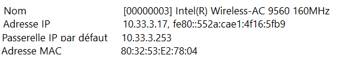
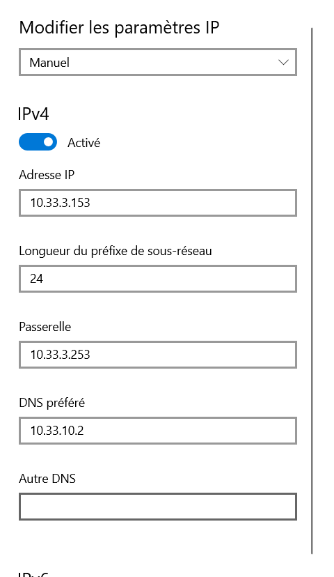
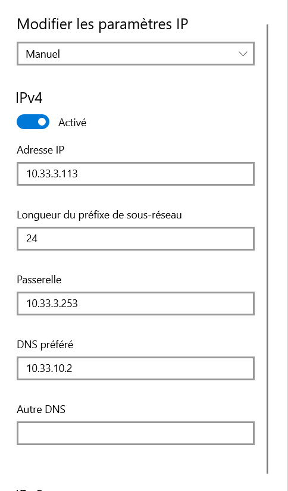
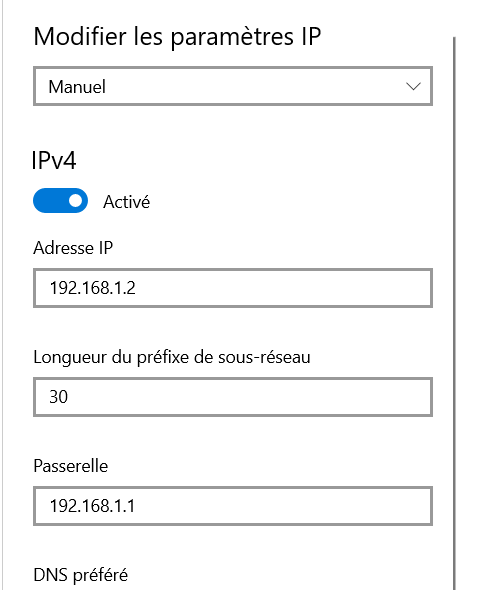
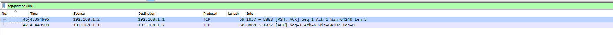
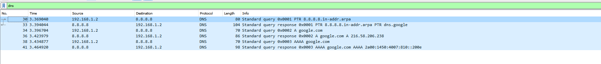

# I. Exploration locale en solo

## 1. Affichage d'informations sur la pile TCP/IP locale


### Infos des cartes réseau de la machine 


```
PS C:\Users\lucas> ipconfig /all

Carte réseau sans fil Wi-Fi :

   Description. . . . . . . . . . . . . . : Intel(R) Wireless-AC 9560 160MHz
   Adresse physique . . . . . . . . . . . : 80-32-53-E2-78-04
   [...]
   Passerelle par défaut. . . . . . . . . : 10.33.3.253
   Adresse IPv4. . . . . . . . . . . . . .: 10.33.3.17(préféré)
   [...]
 
 Carte Ethernet Ethernet :

   Statut du média. . . . . . . . . . . . : Média déconnecté
   [...]
   Description. . . . . . . . . . . . . . : Realtek Gaming GbE Family Controller
   Adresse physique . . . . . . . . . . . : 04-0E-3C-A3-D6-DD
   [...]
```


### L'IP, la MAC et la gateway pour l'interface WiFi de la machine en GUI


- Taper dans la barre de recherche " informations système"

- Cliquez sur "Composants", puis "Réseau" et enfin "Carte"

- rechercher la carte Wi-fi


**Résultat :**





### A quoi sert la gateway dans le réseau d'YNOV ?

* La passerelle du réseau d'Ynov nous permet de communiquer avec d'autres réseaux extérieurs que celui d'Ynov 

## 2. Modifications des informations


### A. Modification de l'adresse IP en GUI (Part 1)




* Il se peut que le pc n'ai pas accès à internet après le changement du dernier octet, car l'adresse IP a pu être déjà adressée à une autre machine.


 ## B. Table ARP
 
 
 ```
 
 PS C:\Users\lucas> arp -a

Interface : 10.33.3.17 --- 0x5
  Adresse Internet      Adresse physique      Type
  10.33.3.253           00-12-00-40-4c-bf     dynamique
  [...]
 ```
* On identifie facilement l'adresse MAC de la passerelle grâce à l'adresse IP qui est facilement identifiable, puisqu'on l'a vu précédemment dans le tp

### Ping vers plusieurs adresses IP du même réseau 

```
PS C:\Users\lucas> ping 10.33.2.16

Envoi d’une requête 'Ping'  10.33.2.16 avec 32 octets de données :
Réponse de 10.33.2.16 : octets=32 temps=57 ms TTL=128
Réponse de 10.33.2.16 : octets=32 temps=69 ms TTL=128
Réponse de 10.33.2.16 : octets=32 temps=222 ms TTL=128
Réponse de 10.33.2.16 : octets=32 temps=68 ms TTL=128

Statistiques Ping pour 10.33.2.16:
    Paquets : envoyés = 4, reçus = 4, perdus = 0 (perte 0%),
Durée approximative des boucles en millisecondes :
    Minimum = 57ms, Maximum = 222ms, Moyenne = 104ms
    
    
 
 PS C:\Users\lucas> ping 10.33.2.14

Envoi d’une requête 'Ping'  10.33.2.14 avec 32 octets de données :
Réponse de 10.33.2.14 : octets=32 temps=92 ms TTL=128
Réponse de 10.33.2.14 : octets=32 temps=45 ms TTL=128
Réponse de 10.33.2.14 : octets=32 temps=375 ms TTL=128
Réponse de 10.33.2.14 : octets=32 temps=67 ms TTL=128

Statistiques Ping pour 10.33.2.14:
    Paquets : envoyés = 4, reçus = 4, perdus = 0 (perte 0%),
Durée approximative des boucles en millisecondes :
    Minimum = 45ms, Maximum = 375ms, Moyenne = 144ms
    
    
    
    PS C:\Users\lucas> ping 10.33.2.79

Envoi d’une requête 'Ping'  10.33.2.79 avec 32 octets de données :
Réponse de 10.33.2.79 : octets=32 temps=108 ms TTL=128
Réponse de 10.33.2.79 : octets=32 temps=7 ms TTL=128
Réponse de 10.33.2.79 : octets=32 temps=6 ms TTL=128
Réponse de 10.33.2.79 : octets=32 temps=57 ms TTL=128

Statistiques Ping pour 10.33.2.79:
    Paquets : envoyés = 4, reçus = , perdus = 0 (perte 0%),
Durée approximative des boucles en millisecondes :
    Minimum = 6ms, Maximum = 108ms, Moyenne = 44ms

 ```

### Adresse MAC des adresse IP 

```
PS C:\Users\lucas> arp -a

Interface : 10.33.3.17 --- 0x5
  Adresse Internet      Adresse physique      Type
  [...]
  10.33.2.14            84-fd-d1-10-23-45     dynamique
  10.33.2.16            70-66-55-8b-df-07     dynamique
  10.33.2.79            a8-7e-ea-46-e7-8b     dynamique
  [...]
```


## C. Nmap


### Changement de l'adresse ip en dynamique 

```
PS C:\Users\lucas> ipconfig

[...]

Carte réseau sans fil Wi-Fi :

   Suffixe DNS propre à la connexion. . . : auvence.co
   Adresse IPv6 de liaison locale. . . . .: fe80::552a:cae1:4f16:5fb9%5
   Adresse IPv4. . . . . . . . . . . . . .: 10.33.3.17
   Masque de sous-réseau. . . . . . . . . : 255.255.252.0
   Passerelle par défaut. . . . . . . . . : 10.33.3.253


```
* Mon PC à reçu automatiquement une adresse IP disponible 


### Scan de ping avec l'outil Nmap 

```
PS C:\Users\lucas> nmap -sP 10.33.0.0/22

[...]
MAC Address: 98:01:A7:CD:A5:D3 (Apple)
Nmap scan report for 10.33.3.35
Host is up (0.0060s latency).
MAC Address: EC:2E:98:CC:6D:17 (AzureWave Technology)
Nmap scan report for 10.33.3.43
Host is up (1.8s latency).
MAC Address: 06:F2:EA:AE:CD:2C (Unknown)
Nmap scan report for 10.33.3.48
Host is up (0.0040s latency).
MAC Address: F8:AC:65:DA:00:C5 (Intel Corporate)
Nmap scan report for 10.33.3.50
Host is up (0.0050s latency).
MAC Address: 18:1D:EA:B4:8C:82 (Intel Corporate)
Nmap scan report for 10.33.3.54
Host is up (0.014s latency).
MAC Address: 70:9C:D1:E0:4E:35 (Intel Corporate)
Nmap scan report for 10.33.3.67
Host is up (0.055s latency).
[...]
MAC Address: 00:1E:4F:F9:BE:14 (Dell)
Nmap scan report for 10.33.3.253
Host is up (0.0070s latency).
MAC Address: 00:12:00:40:4C:BF (Cisco Systems)
Nmap scan report for 10.33.3.254
Host is up (0.0050s latency).
MAC Address: 00:0E:C4:CD:74:F5 (Iskra Transmission d.d.)
Nmap scan report for 10.33.3.17
Host is up.
[...]
Nmap done: 1024 IP addresses (184 hosts up) scanned in 63.93 seconds

```
### Affichage de la table ARP après le scan de ping

```
PS C:\Users\lucas> arp -a

Interface : 10.33.3.17 --- 0x5
  Adresse Internet      Adresse physique      Type
  10.33.0.13            d2-50-0e-26-94-8b     dynamique
  10.33.0.35            70-66-55-52-8a-55     dynamique
  10.33.0.40            dc-21-5c-3b-a3-f3     dynamique
  10.33.0.54            d0-3c-1f-fd-6f-88     dynamique
  10.33.0.71            f0-03-8c-35-fe-47     dynamique
  10.33.0.75            62-77-19-80-6e-28     dynamique
  10.33.0.76            a0-a4-c5-41-bf-4f     dynamique
  10.33.0.87            a0-a4-c5-41-bf-4f     dynamique
  10.33.0.106           a4-6b-b6-16-b5-02     dynamique
  10.33.0.143           f0-18-98-41-11-07     dynamique
  10.33.0.166           7e-7a-66-16-64-ef     dynamique
  10.33.0.172           3a-3a-a7-0a-ea-88     dynamique
  10.33.0.175           74-d8-3e-f2-cc-95     dynamique
  10.33.0.195           12-b9-05-11-2c-54     dynamique
  10.33.0.197           14-7d-da-10-65-78     dynamique
  10.33.0.214           ca-b4-ee-96-25-61     dynamique
  10.33.0.216           64-89-f1-dd-c3-4b     dynamique
  10.33.1.13            14-7d-da-10-65-78     dynamique
  10.33.1.69            a0-a4-c5-41-bf-4f     dynamique
  10.33.1.83            12-51-ba-5d-8b-4a     dynamique
  10.33.1.140           fa-38-8f-3f-42-a0     dynamique
  10.33.1.166           1a-41-0b-54-a5-a0     dynamique
  10.33.1.226           e0-b5-5f-ef-3f-81     dynamique
  10.33.1.232           30-35-ad-af-17-42     dynamique
  10.33.2.11            80-32-53-7e-ae-64     dynamique
  10.33.2.14            84-fd-d1-10-23-45     dynamique
  10.33.2.16            70-66-55-8b-df-07     dynamique
  10.33.2.24            02-24-5e-d2-c9-1e     dynamique
  10.33.2.26            e8-d0-fc-99-1e-ed     dynamique
  10.33.2.42            16-d8-79-91-57-a4     dynamique
  10.33.2.79            a8-7e-ea-46-e7-8b     dynamique
  10.33.2.81            a8-7e-ea-46-e7-8b     dynamique
  10.33.2.84            e4-b3-18-48-36-68     dynamique
  10.33.2.102           66-f4-a5-ba-fe-88     dynamique
  10.33.2.114           40-ec-99-4c-f2-7f     dynamique
  10.33.2.160           de-e6-48-af-e5-d2     dynamique
  10.33.2.176           84-fd-d1-10-23-45     dynamique
  10.33.2.182           a8-7e-ea-46-e7-8b     dynamique
  10.33.2.186           72-63-90-4d-2f-3b     dynamique
  10.33.2.187           a8-7e-ea-46-e7-8b     dynamique
  10.33.2.190           74-4c-a1-d8-e6-03     dynamique
  10.33.2.193           e0-2b-e9-7d-a6-c2     dynamique
  10.33.2.208           a4-b1-c1-72-13-98     dynamique
  10.33.2.209           a4-b1-c1-72-13-98     dynamique
  10.33.2.234           28-df-eb-fb-50-7c     dynamique
  10.33.2.237           be-fd-16-82-f4-05     dynamique
  10.33.3.6             f0-9e-4a-67-dd-c4     dynamique
  10.33.3.13            26-7b-3f-46-6d-9e     dynamique
  10.33.3.22            dc-a2-66-29-52-a1     dynamique
  10.33.3.30            98-01-a7-cd-a5-d3     dynamique
  10.33.3.59            02-47-cd-3d-d4-e9     dynamique
  10.33.3.77            a0-78-17-6b-62-61     dynamique
  10.33.3.131           3c-22-fb-84-d9-68     dynamique
  10.33.3.165           28-d0-ea-f0-bc-61     dynamique
  10.33.3.187           96-fd-87-13-4b-ee     dynamique
  10.33.3.189           c2-6f-43-3d-c7-fa     dynamique
  10.33.3.200           58-96-1d-14-ca-7b     dynamique
  10.33.3.203           70-66-55-cf-4b-3b     dynamique
  10.33.3.210           d8-3b-bf-1a-7a-5c     dynamique
  10.33.3.220           ac-ed-5c-48-c7-90     dynamique
  10.33.3.250           14-f6-d8-43-45-95     dynamique
  10.33.3.253           00-12-00-40-4c-bf     dynamique
  10.33.3.255           ff-ff-ff-ff-ff-ff     statique
  224.0.0.22            01-00-5e-00-00-16     statique
  224.0.0.251           01-00-5e-00-00-fb     statique
  224.0.0.252           01-00-5e-00-00-fc     statique
  239.255.255.250       01-00-5e-7f-ff-fa     statique
  255.255.255.255       ff-ff-ff-ff-ff-ff     statique

``````


## D. Modification d'adresse IP (part.2)

### Scan de ping pour trouver une adresse disponible 

```
PS C:\Users\lucas> nmap -sP 10.33.0.0/22
[...]
MAC Address: 72:85:B9:A6:4E:D2 (Unknown)
Nmap scan report for 10.33.3.112
Host is up (0.056s latency).
MAC Address: 3C:06:30:2D:48:0D (Apple)
Nmap scan report for 10.33.3.122
[...]
```
* On peut remarquer qu'entre la première adresse IP(10.33.3.112) et la deuxième (10.33.3.122), toutes les adresses entre ne sont pas utilisées et sont donc disponibles 

### Changement de l'adresse IP par une adresse disponible 




### Test de connexion 


```
PS C:\Users\lucas>  ping 8.8.8.8
>>

Envoi d’une requête 'Ping'  8.8.8.8 avec 32 octets de données :
Réponse de 8.8.8.8 : octets=32 temps=17 ms TTL=115
Réponse de 8.8.8.8 : octets=32 temps=21 ms TTL=115
Réponse de 8.8.8.8 : octets=32 temps=20 ms TTL=115

Statistiques Ping pour 8.8.8.8:
    Paquets : envoyés = 3, reçus = 3, perdus = 0 (perte 0%),
Durée approximative des boucles en millisecondes :
    Minimum = 17ms, Maximum = 21ms, Moyenne = 19ms
```


# II- Exploration local en duo avec mathis COCO


### 3. Changement de l'adresse IP 

Mon adresse IP est modifiée en 192.168.1.2 et celle de Mathis est 192.168.1.1



```
PS C:\Users\lucas> ipconfig

Configuration IP de Windows


Carte Ethernet Ethernet :

   Suffixe DNS propre à la connexion. . . :
   Adresse IPv6 de liaison locale. . . . .: fe80::b599:9ad5:2d8b:2ffc%21
   Adresse IPv4. . . . . . . . . . . . . .: 192.168.1.2
   Masque de sous-réseau. . . . . . . . . : 255.255.255.252
   Passerelle par défaut. . . . . . . . . : 192.168.1.253

```


### Ping vers mathis 

```
PS C:\Users\lucas> ping 192.168.1.1

Envoi d’une requête 'Ping'  192.168.1.1 avec 32 octets de données :
Réponse de 192.168.1.1 : octets=32 temps<1ms TTL=128
Réponse de 192.168.1.1 : octets=32 temps<1ms TTL=128
Réponse de 192.168.1.1 : octets=32 temps<1ms TTL=128
Réponse de 192.168.1.1 : octets=32 temps<1ms TTL=128

Statistiques Ping pour 192.168.1.1:
    Paquets : envoyés = 4, reçus = 4, perdus = 0 (perte 0%),
Durée approximative des boucles en millisecondes :
    Minimum = 0ms, Maximum = 0ms, Moyenne = 0ms
```


### Consultation de la table ARP avec la nouvelle adresse IP

```

PS C:\Users\lucas> arp -a

[...]

Interface : 192.168.1.2 --- 0x15
  Adresse Internet      Adresse physique      Type
  169.254.146.194       00-e0-4c-68-34-a6     dynamique
  192.168.1.1           00-e0-4c-68-34-a6     dynamique
  192.168.1.3           ff-ff-ff-ff-ff-ff     statique
  224.0.0.22            01-00-5e-00-00-16     statique
  224.0.0.251           01-00-5e-00-00-fb     statique
  224.0.0.252           01-00-5e-00-00-fc     statique
  239.255.255.250       01-00-5e-7f-ff-fa     statique
  255.255.255.255       ff-ff-ff-ff-ff-ff     statique

```

## 4. Utilisation d'un des deux comme gateway

```
Poste sans Wi-fi : Enzo
Mon IP : 192.168.1.2
IP de Mathis : 192.168.1.1
```


### Ping vers un DNS
``` 
PS C:\Users\lucas> ping 1.1.1.1

Envoi d’une requête 'Ping'  1.1.1.1 avec 32 octets de données :
Réponse de 1.1.1.1 : octets=32 temps=21 ms TTL=57
Réponse de 1.1.1.1 : octets=32 temps=22 ms TTL=57

Statistiques Ping pour 1.1.1.1:
    Paquets : envoyés = 2, reçus = 2, perdus = 0 (perte 0%),
Durée approximative des boucles en millisecondes :
    Minimum = 21ms, Maximum = 22ms, Moyenne = 21ms
Ctrl+C
```

### vérification avec tracert 

```
PS C:\Users\lucas> tracert 1.1.1.1

Détermination de l’itinéraire vers one.one.one.one [1.1.1.1]
avec un maximum de 30 sauts :

  1     1 ms     2 ms     1 ms  LAPTOP-V8G7251P [192.168.1.1]
  2     *        *
 ```
## 5. Petit chat privé 
 * (côté serveur)

```
 PS C:\Users\Mathis\netcat> .\nc.exe -l -p 8888
test
coucou
salut
```

* (côté client)

```
PS C:\Users\lucas\Downloads\netcat\netcat-1.11> .\nc64.exe 192.168.1.1 8888
test
coucou
salut
```


 ## 6. Firewall
 
 * Tout d'abord il faut commencer par aller les paramètres avancés de windows défender
* Pour se faire il faut aller dans : Panneau de configuration / Système et sécurité / Pare-feu Windows Defender / Paramètres avancés / Règles de trafic entrant
* On défile vers le bas jusqu'à arriver à "Partage de fichiers et d'imprimantes (Demande d'echo - Trafic entrant ICMPv4) avec comme domaine "privé". On active ce paramètre, cela va autoriser les ping entrant tout en laissant le firewall, activé.

### ping de mon côté 

```
PS C:\Users\lucas> ping 192.168.1.1

Envoi d’une requête 'Ping'  192.168.1.1 avec 32 octets de données :
Réponse de 192.168.1.1 : octets=32 temps=2 ms TTL=128
Réponse de 192.168.1.1 : octets=32 temps=3 ms TTL=128

Statistiques Ping pour 192.168.1.1:
    Paquets : envoyés = 2, reçus = 2, perdus = 0 (perte 0%),
Durée approximative des boucles en millisecondes :
    Minimum = 2ms, Maximum = 3ms, Moyenne = 2ms
```

### ping du côté de Mathis

```
PS C:\Users\Mathis> ping 192.168.1.2

Envoi d’une requête 'Ping'  192.168.1.2 avec 32 octets de données :
Réponse de 192.168.1.2 : octets=32 temps=2 ms TTL=128
Réponse de 192.168.1.2 : octets=32 temps=2 ms TTL=128
Réponse de 192.168.1.2 : octets=32 temps=3 ms TTL=128
Réponse de 192.168.1.2 : octets=32 temps=2 ms TTL=128

Statistiques Ping pour 192.168.1.2:
    Paquets : envoyés = 4, reçus = 4, perdus = 0 (perte 0%),
Durée approximative des boucles en millisecondes :
    Minimum = 2ms, Maximum = 3ms, Moyenne = 2ms

```

# III. Manipulations d'autres outils/protocoles côté client


## 1. DHCP

### Affichage de l'adresse IP du serveur DHCP d'Ynov ainsi que le bail DHCP 

```
PS C:\Users\lucas> ipconfig /all

Carte réseau sans fil Wi-Fi :

   Suffixe DNS propre à la connexion. . . : auvence.co
   Description. . . . . . . . . . . . . . : Intel(R) Wireless-AC 9560 160MHz
   Adresse physique . . . . . . . . . . . : 80-32-53-E2-78-04
   DHCP activé. . . . . . . . . . . . . . : Oui
   Configuration automatique activée. . . : Oui
   Adresse IPv6 de liaison locale. . . . .: fe80::552a:cae1:4f16:5fb9%5(préféré)
   Adresse IPv4. . . . . . . . . . . . . .: 10.33.3.17(préféré)
   Masque de sous-réseau. . . . . . . . . : 255.255.252.0
   Bail obtenu. . . . . . . . . . . . . . : vendredi 17 septembre 2021 13:03:22
   Bail expirant. . . . . . . . . . . . . : vendredi 17 septembre 2021 15:03:22
   Passerelle par défaut. . . . . . . . . : 10.33.3.253
   Serveur DHCP . . . . . . . . . . . . . : 10.33.3.254
   [...]
```


## 2. DNS

```
PS C:\Users\lucas> ipconfig /all

Carte réseau sans fil Wi-Fi :
[...]
   Serveurs DNS. . .  . . . . . . . . . . : 10.33.10.2
                                       10.33.10.148
                                       10.33.10.155
[...]


```

### lookup de google.com et ynov.com


```
PS C:\Users\lucas> nslookup google.com
Serveur :   UnKnown
Address:  10.33.10.2

Réponse ne faisant pas autorité :
Nom :    google.com
Addresses:  2a00:1450:4007:805::200e
          216.58.213.174
          
          
          

PS C:\Users\lucas> nslookup ynov.com
Serveur :   UnKnown
Address:  10.33.10.2

Réponse ne faisant pas autorité :
Nom :    ynov.com
Address:  92.243.16.143
```

* Les deux adresses ci-dessous sont des adresse publiques, si on copie l'adresse d'une des deux et qu'on la rentre dans la barre de recherche d'un navigateur web , on est directement dirigé soit vers google.com ou alors vers ynov.com pour l'autre.
* l'Adresse IP du serveur à qui on vient d'effectuer les requêtes correspond à l'adresse du serveur DNS : 10.33.10.2 

```
PS C:\Users\lucas> nslookup 78.74.21.21
Serveur :   UnKnown
Address:  10.33.10.2

Nom :    host-78-74-21-21.homerun.telia.com
Address:  78.74.21.21

PS C:\Users\lucas> nslookup 92.146.54.88
Serveur :   UnKnown
Address:  10.33.10.2

Nom :    apoitiers-654-1-167-88.w92-146.abo.wanadoo.fr
Address:  92.146.54.88
```

* On obtient les nom de domaine liés aux adresses, cependant on ne peut pas rechercher à partir d'un navigateur par rapport à celle de Google et Ynov.

## IV. Wireshark

### Trame ping entre les deux machines 


### Netcat entre les deux machines 


* J'ai appliqué un filtre de protocole pour récupérer les paquets venant du port TCP 8888 (port utilisé par netcat). 


### Requête DNS vers google.com 

```
PS C:\Users\lucas> nslookup google.com
Serveur :   dns.google
Address:  8.8.8.8

Réponse ne faisant pas autorité :
Nom :    google.com
Addresses:  2a00:1450:4007:810::200e
          216.58.206.238
```



* J'ai appliqué un filtre de protocole pour récupérer les paquets correspondant à la requête DNS