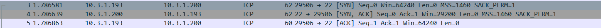
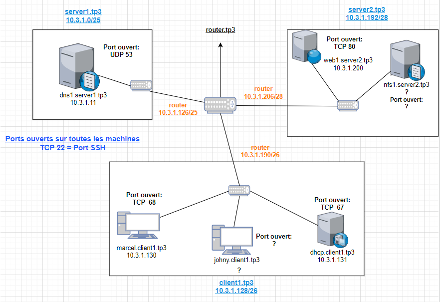

# TP3 : Progressons vers le réseau d'infrastructure

# Sommaire

- [TP3 : Progressons vers le réseau d'infrastructure](#tp3--progressons-vers-le-réseau-dinfrastructure)
- [Sommaire](#sommaire)
- [I. (mini)Architecture réseau](#i-miniarchitecture-réseau)
  - [A. Tableau des réseaux](#a-tableau-des-reseaux)
- [II. Services d'infra](#ii-services-dinfra)
  - [1. Serveur DHCP](#1-serveur-dhcp)
  - [2. Serveur DNS](#2-serveur-dns)
    - [A. Our own DNS server](#a-our-own-dns-server)
    - [B. SETUP copain](#b-setup-copain)
  - [3. Get deeper](#3-get-deeper)
    - [A. DNS forwarder](#a-dns-forwarder)
    - [B. On revient sur la conf du DHCP](#b-on-revient-sur-la-conf-du-dhcp)
- [III. Services métier](#iii-services-métier)
  - [1. Serveur Web](#1-serveur-web)
- [IV. Un peu de théorie : TCP et UDP](#iv-un-peu-de-théorie--tcp-et-udp)
- [V. El final](#v-el-final)
- [A. Tableau d'adressage](#a-tableau-dadressage)

# I. (mini)Architecture réseau


🌞 **Vous me rendrez un 🗃️ tableau des réseaux 🗃️ qui rend compte des adresses choisies, sous la forme** :

## A. Tableau des reseaux

| Nom du réseau | Adresse du réseau | Masque        | Nombre de clients possibles | Adresse passerelle | [Adresse broadcast] |
|---------------|-------------------|---------------|-----------------------------|--------------------|----------------------------------------------------------------------------------------------|
| `client1`     | `10.3.1.128`        | `255.255.255.192` | 62                           | `10.3.1.190`         | `10.3.1.191`                                                                                   |
| `server1`     | `10.3.1.0`        | `255.255.255.128` | 126                           | `10.3.1.126`         | `10.3.1.127`                                                                                   |
| `server2`     | `10.3.1.192`        | `255.255.255.208` | 14                           | `10.3.1.206`         | `10.3.1.207`

🌞 **Vous pouvez d'ores-et-déjà créer le routeur. Pour celui-ci, vous me prouverez que :**

* Détails de la VM `Router` dans Vbox :


```bash
# il a bien une IP dans les 3 réseaux, l'IP que vous avez choisie comme IP de passerelle
## Conf des trois cartes 
[targa@router network-scripts]$ cat ifcfg-enp0s8

BOOTPROTO=static
DEFROUTE=yes

NAME=enp0s8
DEVICE=enp0s8
ONBOOT=yes

IPADDR=10.3.1.126
NETMASK=255.255.255.128
DNS1=1.1.1.1

[targa@router network-scripts]$ cat ifcfg-enp0s9

BOOTPROTO=static
NAME=enp0s9
DEVICE=enp0s9
ONBOOT=yes

IPADDR=10.3.1.190
NETMASK=255.255.255.192
DNS1=1.1.1.1

[targa@router network-scripts]$ cat ifcfg-enp0s10

BOOTPROTO=static
NAME=enp0s10
DEVICE=enp0s10
ONBOOT=yes

IPADDR=10.3.1.206
NETMASK=255.255.255.208
DNS1=1.1.1.1

# Il a un accès internet
## Info carte NAT
[targa@router network-scripts]$ ip a
[...]
2: enp0s3: <BROADCAST,MULTICAST,UP,LOWER_UP> mtu 1500 qdisc fq_codel state UP group default qlen 1000
    link/ether 08:00:27:48:92:14 brd ff:ff:ff:ff:ff:ff
    inet 10.0.2.15/24 brd 10.0.2.255 scope global dynamic noprefixroute enp0s3
       valid_lft 83343sec preferred_lft 83343sec
    inet6 fe80::a00:27ff:fe48:9214/64 scope link noprefixroute
       valid_lft forever preferred_lft forever
## Route par défaut
[targa@router network-scripts]$ ip r s
default via 10.0.2.2 dev enp0s3 proto dhcp metric 101
10.0.2.0/24 dev enp0s3 proto kernel scope link src 10.0.2.15 metric 101
[...]
## Ping fonctionnel vers un serveur connu d'internet
[targa@router network-scripts]$ ping -c 2 8.8.8.8
PING 8.8.8.8 (8.8.8.8) 56(84) bytes of data.
64 bytes from 8.8.8.8: icmp_seq=1 ttl=114 time=21.8 ms
64 bytes from 8.8.8.8: icmp_seq=2 ttl=114 time=21.3 ms

--- 8.8.8.8 ping statistics ---
2 packets transmitted, 2 received, 0% packet loss, time 1002ms
rtt min/avg/max/mdev = 21.264/21.522/21.780/0.258 ms
# il a de la résolution de noms
##  Modification de la conf d'interface pour ajouter le DNS ( voir plus haut les conf des cartes)
## On recharge les conf 
[targa@router network-scripts]$ sudo nmcli con reload

[targa@router network-scripts]$ sudo nmcli con up enp0s8
Connection successfully activated (D-Bus active path: /org/freedesktop/NetworkManager/ActiveConnection/9)

[targa@router network-scripts]$ sudo nmcli con up enp0s9
Connection successfully activated (D-Bus active path: /org/freedesktop/NetworkManager/ActiveConnection/10)

[targa@router network-scripts]$ sudo nmcli con up enp0s10
Connection successfully activated (D-Bus active path: /org/freedesktop/NetworkManager/ActiveConnection/11)
## Vérification que la conf a changé
[targa@router ~]$ cat /etc/resolv.conf
# Generated by NetworkManager
search home tp3
nameserver 192.168.1.1
nameserver 1.1.1.1
## Test avec dig
[targa@router ~]$ dig google.com @1.1.1.1

; <<>> DiG 9.11.26-RedHat-9.11.26-4.el8_4 <<>> google.com @1.1.1.1
;; global options: +cmd
;; Got answer:
;; ->>HEADER<<- opcode: QUERY, status: NOERROR, id: 40392
;; flags: qr rd ra; QUERY: 1, ANSWER: 1, AUTHORITY: 0, ADDITIONAL: 1

;; OPT PSEUDOSECTION:
; EDNS: version: 0, flags:; udp: 1232
;; QUESTION SECTION:
;google.com.                    IN      A

;; ANSWER SECTION:
google.com.             160     IN      A       172.217.19.238

;; Query time: 24 msec
;; SERVER: 1.1.1.1#53(1.1.1.1)
;; WHEN: Thu Sep 30 11:15:58 CEST 2021
;; MSG SIZE  rcvd: 55
```

```bash
# réponse dans le dig
google.com.             160     IN      A       172.217.19.238
```

```bash
# L'IP du serveur qui a répondu :
;; SERVER: 1.1.1.1#53(1.1.1.1)

```

```bash
# il porte le nom `router.tp3`
## Définition du nom de domaine
[targa@router ~]$ sudo hostname router.tp3
[sudo] password for targa:
[targa@router ~]$ echo "router.tp3" | sudo tee /etc/hostname
router.tp3
## vérification 
[targa@router ~]$ hostname
router.tp3
# activer le routage sur la machine
## On repère la zone utilisée par firewalld, généralement 'public' si vous n'avez pas fait de conf spécifique
 [targa@router ~]$ sudo firewall-cmd --list-all
public (active)
  target: default
  icmp-block-inversion: no
  interfaces: enp0s10 enp0s3 enp0s8 enp0s9
  sources:
  services: cockpit dhcpv6-client ssh
  ports:
  protocols:
  masquerade: yes
  forward-ports:
  source-ports:
  icmp-blocks:
  rich rules:
## activation du masquerading
[targa@router ~]$ sudo firewall-cmd --add-masquerade --zone=public --permanent
success

```
---

# II. Services d'infra

## 1. Serveur DHCP

🌞 **Mettre en place une machine qui fera office de serveur DHCP** dans le réseau `client1`. Elle devra :

```bash
# porter le nom `dhcp.client1.tp3`


- donner une IP aux machines clients qui le demande
## Définition du nom de domaine
[targa@dhcp ~]$ sudo hostname dhcp.client1.tp3
[sudo] password for targa:
[targa@dhcp ~]$ echo "dhcp.client1.tp3" | sudo tee /etc/hostname
dhcp.client1.tp3
## vérification 
[targa@dhcp ~]$ hostname
dhcp.client1.tp3
## fichier dhcpd.conf (temporaire le temps que je l'enregistre dans un dossier dans mon git)
# leur donner l'adresse de leur passerelle
 option routers 10.3.1.190;
# leur donner l'adresse d'un DNS utilisable
 option domain-name-servers 1.1.1.1;
# lancement du serveur dhcp et vérification
[targa@dhcp ~]$ systemctl start dhcpd
[targa@dhcp ~]$ systemctl enable dhcpd
Created symlink /etc/systemd/system/multi-user.target.wants/dhcpd.service → /usr/lib/systemd/system/dhcpd.service.
[targa@dhcp ~]$ systemctl status dhcpd
● dhcpd.service - DHCPv4 Server Daemon
   Loaded: loaded (/usr/lib/systemd/system/dhcpd.service; disabled; vendor preset: disabled)
   Active: active (running) since Mon 2021-10-04 15:42:49 CEST; 11s ago
     Docs: man:dhcpd(8)
           man:dhcpd.conf(5)
 Main PID: 1569 (dhcpd)
   Status: "Dispatching packets..."
    Tasks: 1 (limit: 4946)
   Memory: 4.8M
   CGroup: /system.slice/dhcpd.service
           └─1569 /usr/sbin/dhcpd -f -cf /etc/dhcp/dhcpd.conf -user dhcpd -group dhcpd --no-pid

Oct 04 15:42:49 dhcp.client1.tp3 dhcpd[1569]: Config file: /etc/dhcp/dhcpd.conf
Oct 04 15:42:49 dhcp.client1.tp3 dhcpd[1569]: Database file: /var/lib/dhcpd/dhcpd.leases
Oct 04 15:42:49 dhcp.client1.tp3 dhcpd[1569]: PID file: /var/run/dhcpd.pid
Oct 04 15:42:49 dhcp.client1.tp3 dhcpd[1569]: Source compiled to use binary-leases
Oct 04 15:42:49 dhcp.client1.tp3 dhcpd[1569]: Wrote 0 leases to leases file.
Oct 04 15:42:49 dhcp.client1.tp3 dhcpd[1569]: Listening on LPF/enp0s8/08:00:27:07:5e:db/10.3.1.128/26
Oct 04 15:42:49 dhcp.client1.tp3 dhcpd[1569]: Sending on   LPF/enp0s8/08:00:27:07:5e:db/10.3.1.128/26
Oct 04 15:42:49 dhcp.client1.tp3 dhcpd[1569]: Sending on   Socket/fallback/fallback-net
Oct 04 15:42:49 dhcp.client1.tp3 dhcpd[1569]: Server starting service.
Oct 04 15:42:49 dhcp.client1.tp3 systemd[1]: Started DHCPv4 Server Daemon.


```
📁 **Fichier `dhcpd.conf`**

https://gitlab.com/EPEYRATAUD/b2-work-reseau/-/blob/main/TP-3/conf/dhcpd.conf


🌞 **Mettre en place un client dans le réseau `client1`**
```bash
 # de son p'tit nom `marcel.client1.tp3`
 ## Définition du nom de domaine
 [targa@marcel ~]$ sudo hostname marcel.client1.tp3
 [sudo] password for targa:
 [targa@marcel ~]$ echo "marcel.client1.tp3" | sudo tee /etc/hostname
 marcel.client1.tp3
 ## vérification
 [targa@marcel ~]$ hostname
marcel.client1.tp3
 # la machine récupérera une IP dynamiquement grâce au serveur DHCP

 ## demande d'une adresse ip à la machine dhcp 
 [targa@marcel ~]$ dhclient enp0s8
 [targa@marcel ~]$ sudo nmcli con reload
[targa@marcel ~]$ sudo nmcli con up enp0s8
Connection successfully activated (D-Bus active path: /org/freedesktop/NetworkManager/ActiveConnection/4)
[targa@marcel ~]$ ip a
[...]
2: enp0s8: <BROADCAST,MULTICAST,UP,LOWER_UP> mtu 1500 qdisc fq_codel state UP group default qlen 1000
    link/ether 08:00:27:1a:02:33 brd ff:ff:ff:ff:ff:ff
    inet 10.3.1.130/26 brd 10.3.1.191 scope global dynamic noprefixroute enp0s8
       valid_lft 771sec preferred_lft 771sec
    inet6 fe80::a00:27ff:fe1a:233/64 scope link
       valid_lft forever preferred_lft forever

## preuve de la distribution d'une ip depuis la machine dhcp
[targa@dhcp ~]$  systemctl status dhcpd
● dhcpd.service - DHCPv4 Server Daemon
   Loaded: loaded (/usr/lib/systemd/system/dhcpd.service; enabled; vendor preset: disabled)
   Active: active (running) since Mon 2021-10-04 15:42:49 CEST; 31min ago
     Docs: man:dhcpd(8)
           man:dhcpd.conf(5)
 Main PID: 1569 (dhcpd)
   Status: "Dispatching packets..."
    Tasks: 1 (limit: 4946)
   Memory: 4.9M
   CGroup: /system.slice/dhcpd.service
           └─1569 /usr/sbin/dhcpd -f -cf /etc/dhcp/dhcpd.conf -user dhcpd -group dhcpd --no-pid

Oct 04 16:09:23 dhcp.client1.tp3 dhcpd[1569]: DHCPOFFER on 10.3.1.130 to 08:00:27:1a:02:33 via enp0s8
Oct 04 16:09:23 dhcp.client1.tp3 dhcpd[1569]: DHCPREQUEST for 10.3.1.130 (10.3.1.131) from 08:00:27:1a:02:33 via enp0s8
Oct 04 16:09:23 dhcp.client1.tp3 dhcpd[1569]: DHCPACK on 10.3.1.130 to 08:00:27:1a:02:33 via enp0s8
Oct 04 16:12:03 dhcp.client1.tp3 dhcpd[1569]: DHCPDISCOVER from 08:00:27:1a:02:33 via enp0s8
Oct 04 16:12:04 dhcp.client1.tp3 dhcpd[1569]: DHCPOFFER on 10.3.1.130 to 08:00:27:1a:02:33 (marcel) via enp0s8
Oct 04 16:12:04 dhcp.client1.tp3 dhcpd[1569]: DHCPREQUEST for 10.3.1.130 (10.3.1.131) from 08:00:27:1a:02:33 (marcel) via enp0s8
Oct 04 16:12:04 dhcp.client1.tp3 dhcpd[1569]: DHCPACK on 10.3.1.130 to 08:00:27:1a:02:33 (marcel) via enp0s8
Oct 04 16:12:12 dhcp.client1.tp3 dhcpd[1569]: reuse_lease: lease age 8 (secs) under 25% threshold, reply with unaltered, existing lease for 10.3.1.130
Oct 04 16:12:12 dhcp.client1.tp3 dhcpd[1569]: DHCPREQUEST for 10.3.1.130 from 08:00:27:1a:02:33 (marcel) via enp0s8
Oct 04 16:12:12 dhcp.client1.tp3 dhcpd[1569]: DHCPACK on 10.3.1.130 to 08:00:27:1a:02:33 (marcel) via enp0s8
```

🌞 **Depuis `marcel.client1.tp3`**

```bash
 # prouver qu'il a un accès internet + résolution de noms, avec des infos récupérées par votre DHCP
  ## Info sur la carte NAT
  [targa@marcel ~]$ ip a
1: lo: <LOOPBACK,UP,LOWER_UP> mtu 65536 qdisc noqueue state UNKNOWN group default qlen 1000
    link/loopback 00:00:00:00:00:00 brd 00:00:00:00:00:00
    inet 127.0.0.1/8 scope host lo
       valid_lft forever preferred_lft forever
    inet6 ::1/128 scope host
       valid_lft forever preferred_lft forever
  ## Route par défaut
  [targa@marcel ~]$ ip r s
default via 10.3.1.190 dev enp0s8 proto dhcp metric 100
10.3.1.128/26 dev enp0s8 proto kernel scope link src 10.3.1.130 metric 100
  ## Ping fonctionnel vers un serveur connu d'internet
  [targa@marcel ~]$ ping -c 2 8.8.8.8
PING 8.8.8.8 (8.8.8.8) 56(84) bytes of data.
64 bytes from 8.8.8.8: icmp_seq=1 ttl=113 time=22.0 ms
64 bytes from 8.8.8.8: icmp_seq=2 ttl=113 time=21.6 ms

--- 8.8.8.8 ping statistics ---
2 packets transmitted, 2 received, 0% packet loss, time 1001ms
rtt min/avg/max/mdev = 21.578/21.791/22.004/0.213 ms
 # à l'aide de la commande `traceroute`, prouver que `marcel.client1.tp3` passe par `router.tp3` pour sortir de son réseau
 [targa@marcel ~]$ traceroute 10.3.1.190
traceroute to 10.3.1.190 (10.3.1.190), 30 hops max, 60 byte packets
 1  _gateway (10.3.1.190)  0.480 ms !X  0.453 ms !X  0.392 ms !X 
```
## 2. Serveur DNS

### B. SETUP copain

🌞 **Mettre en place une machine qui fera office de serveur DNS**
- [A. Tableau des réseaux](#a-tableau-des-reseaux)
```bash
# dans le réseau `server1`
## affichage de la carte enp0s8 -> voir le tableau des reseaux ( lien au dessus )
[targa@dns1 ~]$ ip a
[...]
2: enp0s8: <BROADCAST,MULTICAST,UP,LOWER_UP> mtu 1500 qdisc fq_codel state UP group default qlen 1000
    link/ether 08:00:27:3d:f1:da brd ff:ff:ff:ff:ff:ff
    inet 10.3.1.11/25 brd 10.3.1.127 scope global noprefixroute enp0s8
       valid_lft forever preferred_lft forever
    inet6 fe80::a00:27ff:fe3d:f1da/64 scope link
       valid_lft forever preferred_lft forever
# de son p'tit nom `dns1.server1.tp3`
## Définition du nom de domaine
[targa@dns1 ~]$ sudo hostname dns1.server1.tp3
[targa@dns1 ~]$ echo "dns1.server1.tp3" | sudo tee /etc/hostname
dns1.server1.tp3
## vérification 
[targa@dns1 ~]$ hostname
dns1.server1.tp3

# il faudra lui ajouter un serveur DNS public connu, afin qu'il soit capable de résoudre des noms publics comme `google.com`
[targa@dns1 ~]$ cat /etc/resolv.conf
search server1.tp3
nameserver 8.8.8.8

#installation du serveur dns 
[targa@dns1 ~]$ sudo dnf install -y bind bind-utils
[...]


```
- fichier de conf `named.conf` 

https://gitlab.com/EPEYRATAUD/b2-work-reseau/-/blob/main/TP-3/conf/named.conf

- fichier de zones `server1.tp3.forward` et `server2.tp3.forward`

https://gitlab.com/EPEYRATAUD/b2-work-reseau/-/blob/main/TP-3/conf/server1.tp3.forward

https://gitlab.com/EPEYRATAUD/b2-work-reseau/-/blob/main/TP-3/conf/server2.tp3.forward

```bash
# lancement du service
[targa@dns1 ~]$ sudo systemctl enable named
Created symlink /etc/systemd/system/multi-user.target.wants/named.service → /usr/lib/systemd/system/named.service.
[targa@dns1 ~]$ sudo systemctl start named

# ajout du service dns sur le firewall
[targa@dns1 ~]$ sudo firewall-cmd --add-service=dns --permanent
success
[targa@dns1 ~]$ sudo firewall-cmd --reload
success
[targa@dns1 ~]$ sudo firewall-cmd --list-all
public (active)
  target: default
  icmp-block-inversion: no
  interfaces: enp0s8
  sources:
  services: dns ssh
  ports: 53/tcp
  protocols:
  masquerade: no
  forward-ports:
  source-ports:
  icmp-blocks:
  rich rules:

```

🌞 **Tester le DNS depuis `marcel.client1.tp3`**

```bash
#Tester le DNS depuis marcel.client1.tp3
## Affichage du serveur DNS utilisée
[targa@marcel etc]$ cat /etc/resolv.conf
nameserver 10.3.1.11
#test
[targa@marcel etc]$ dig dns1.server1.tp3
; <<>> DiG 9.11.26-RedHat-9.11.26-4.el8_4 <<>> dns1.server1.tp3
;; global options: +cmd
;; Got answer:
;; ->>HEADER<<- opcode: QUERY, status: NOERROR, id: 58935
;; flags: qr aa rd ra; QUERY: 1, ANSWER: 1, AUTHORITY: 1, ADDITIONAL: 1

;; OPT PSEUDOSECTION:
; EDNS: version: 0, flags:; udp: 1232
; COOKIE: be3d55b502ef4eb66a596e9c616b8f33eb9d31aad8b560ca (good)
;; QUESTION SECTION:
;dns1.server1.tp3.              IN      A

;; ANSWER SECTION:
dns1.server1.tp3.       86400   IN      A       10.3.1.11

;; AUTHORITY SECTION:
server1.tp3.            86400   IN      NS      dns1.server1.tp3.

;; Query time: 0 msec
;; SERVER: 10.3.1.11#53(10.3.1.11)
;; WHEN: Sun Oct 17 04:49:08 CEST 2021
;; MSG SIZE  rcvd: 103
```
[A. Tableau d'adressage](#a-tableau-dadressage)
```bash
# Preuve que c'est bien le dns local (voir tableau d'adressage pour la preuve que c'est la bonne ip )
[...]
;; SERVER: 10.3.1.11#53(10.3.1.11)
[...]
```


🌞 Configurez l'utilisation du serveur DNS sur TOUS vos noeuds

```bash
# les serveurs, on le fait à la main
[targa@dhcp ~]$ cat /etc/resolv.conf
search server1.tp3
nameserver 10.3.1.11

# les clients, c'est fait via DHCP
[root@dhcp ~]# vim /etc/dhcp/dhcpd.conf
 option domain-name-servers 10.3.1.11 ;

```

## 3. Get deeper

On va affiner un peu la configuration des outils mis en place.

### A. DNS forwarder

🌞 **Affiner la configuration du DNS**

```bash
[targa@dns1 ~]$ sudo vim /etc/named.conf
    [...]
        recursion yes;

    forwarders {
            8.8.8.8;
            1.1.1.1;
    };
    [...]

```

🌞 Test !

```bash
# vérifier depuis `marcel.client1.tp3` que vous pouvez résoudre des noms publics comme `google.com` en utilisant votre propre serveur DNS (commande `dig`)
[targa@marcel etc]$ dig google.com

; <<>> DiG 9.11.26-RedHat-9.11.26-4.el8_4 <<>> google.com
;; global options: +cmd
;; Got answer:
;; ->>HEADER<<- opcode: QUERY, status: SERVFAIL, id: 40773
;; flags: qr rd ra; QUERY: 1, ANSWER: 1, AUTHORITY: 4, ADDITIONAL: 9

;; OPT PSEUDOSECTION:
; EDNS: version: 0, flags:; udp: 1232
; COOKIE: a06c1d364ad873c1dd991392616b9556fbd7b01bb8263f7f (good)
;; QUESTION SECTION:
;google.com.                    IN      A

;; ANSWER SECTION:
google.com.             300     IN      A       142.250.74.238

;; AUTHORITY SECTION:
google.com.             172282  IN      NS      ns2.google.com.
google.com.             172282  IN      NS      ns3.google.com.
google.com.             172282  IN      NS      ns4.google.com.
google.com.             172282  IN      NS      ns1.google.com.

;; ADDITIONAL SECTION:
ns2.google.com.         172282  IN      A       216.239.34.10
ns1.google.com.         172282  IN      A       216.239.32.10
ns3.google.com.         172282  IN      A       216.239.36.10
ns4.google.com.         172282  IN      A       216.239.38.10
ns2.google.com.         172282  IN      AAAA    2001:4860:4802:34::a
ns1.google.com.         172282  IN      AAAA    2001:4860:4802:32::a
ns3.google.com.         172282  IN      AAAA    2001:4860:4802:36::a
ns4.google.com.         172282  IN      AAAA    2001:4860:4802:38::a

;; Query time: 1949 msec
;; SERVER: 10.3.1.11#53(10.3.1.11)
[...]

```

```bash
# pour que ça fonctionne, il faut que `dns1.server1.tp3` soit lui-même capable de résoudre des noms, avec `1.1.1.1` par exemple

```

### B. On revient sur la conf du DHCP

🌞 **Affiner la configuration du DHCP**

```bash
# faites en sorte que votre DHCP donne désormais l'adresse de votre serveur DNS aux clients
[root@dhcp dhcp]# cat dhcpd.conf
default-lease-time 900;
max-lease-time 10800;
ddns-update-style none;
authoritative;
subnet 10.3.1.128 netmask 255.255.255.192 {
  range 10.3.1.130 10.3.1.189;
  option routers 10.3.1.190;
  option subnet-mask 255.255.255.192;
  option domain-name "client1.tp3";
  option domain-name-servers 10.3.1.11;
}
[targa@dhcp ~]$ sudo systemctl restart dhcpd

```
---
# III. Services métier

## 1. Serveur Web

🌞 **Setup d'une nouvelle machine, qui sera un serveur Web, une belle appli pour nos clients**

- configuration du firewall : ajout du port tcp 80
```
[targa@web1 var]$ sudo firewall-cmd --list-all
public (active)
  target: default
  icmp-block-inversion: no
  interfaces: enp0s3 enp0s8
  sources:
  services: cockpit dhcpv6-client ssh
  ports: 80/tcp
  protocols:
  masquerade: no
  forward-ports:
  source-ports:
  icmp-blocks:
  rich rules:
```
- test avec curl depuis `marcel.client1.tp3`
```
[targa@marcel etc]$ curl 10.3.1.200:80
<!DOCTYPE html PUBLIC "-//W3C//DTD XHTML 1.1//EN" "http://www.w3.org/TR/xhtml11/DTD/xhtml11.dtd">

<html xmlns="http://www.w3.org/1999/xhtml" xml:lang="en">
  <head>
    <title>Test Page for the Nginx HTTP Server on Rocky Linux</title>
    <meta http-equiv="Content-Type" content="text/html; charset=UTF-8" />
    <style type="text/css">
      /*<![CDATA[*/
      body {
        background-color: #fff;
        color: #000;
        font-size: 0.9em;
        font-family: sans-serif, helvetica;
        margin: 0;
        padding: 0;
      }
      :link {
        color: #c00;
      }
      :visited {
        color: #c00;
      }
      a:hover {
        color: #f50;
      }
      h1 {
        text-align: center;
        margin: 0;
        padding: 0.6em 2em 0.4em;
        background-color: #10B981;
        color: #fff;
        font-weight: normal;
        font-size: 1.75em;
        border-bottom: 2px solid #000;
      }
      h1 strong {
        font-weight: bold;
        font-size: 1.5em;
      }
      h2 {
        text-align: center;
        background-color: #10B981;
        font-size: 1.1em;
        font-weight: bold;
        color: #fff;
        margin: 0;
        padding: 0.5em;
        border-bottom: 2px solid #000;
      }
      hr {
        display: none;
      }
      .content {
        padding: 1em 5em;
      }
      .alert {
        border: 2px solid #000;
      }

      img {
        border: 2px solid #fff;
        padding: 2px;
        margin: 2px;
      }
      a:hover img {
        border: 2px solid #294172;
      }
      .logos {
        margin: 1em;
        text-align: center;
      }
      /*]]>*/
    </style>
  </head>

  <body>
    <h1>Welcome to <strong>nginx</strong> on Rocky Linux!</h1>

    <div class="content">
      <p>
        This page is used to test the proper operation of the
        <strong>nginx</strong> HTTP server after it has been installed. If you
        can read this page, it means that the web server installed at this site
        is working properly.
      </p>

      <div class="alert">
        <h2>Website Administrator</h2>
        <div class="content">
          <p>
            This is the default <tt>index.html</tt> page that is distributed
            with <strong>nginx</strong> on Rocky Linux. It is located in
            <tt>/usr/share/nginx/html</tt>.
          </p>

          <p>
            You should now put your content in a location of your choice and
            edit the <tt>root</tt> configuration directive in the
            <strong>nginx</strong>
            configuration file
            <tt>/etc/nginx/nginx.conf</tt>.
          </p>

          <p>
            For information on Rocky Linux, please visit the
            <a href="https://www.rockylinux.org/">Rocky Linux website</a>. The
            documentation for Rocky Linux is
            <a href="https://www.rockylinux.org/"
              >available on the Rocky Linux website</a
            >.
          </p>
        </div>
      </div>

      <div class="logos">
        <a href="http://nginx.net/"
          ></a>
        <a href="http://www.rockylinux.org/"></a>

      </div>
    </div>
  </body>
</html>
```


# IV. Un peu de théorie : TCP et UDP

🌞 **Déterminer, pour chacun de ces protocoles, s'ils sont encapsulés dans du TCP ou de l'UDP :**

- SSH
```
Port 22 / TCP 
```
- HTTP
```
Port 80 / TCP
```
- DNS
```
Port 53 / UDP
```
-

📁 **Captures réseau `tp3_ssh.pcap`, `tp3_http.pcap`, `tp3_dns.pcap`**

https://gitlab.com/EPEYRATAUD/b2-work-reseau/-/blob/main/TP-3/capture/tp3_ssh.pcap

https://gitlab.com/EPEYRATAUD/b2-work-reseau/-/blob/main/TP-3/capture/tp3_dns.pcap


🌞 **Expliquez-moi pourquoi je ne pose pas la question pour DHCP.**

```
Car les échanges de paquets se font uniquement lors de la distribution d'IP
```

🌞 **Capturez et mettez en évidence un *3-way handshake***

- 3-way handshake visible dans au début de la capture de `tp3_ssh.pcap`
  
# V. El final

- Schéma du réseau


https://gitlab.com/EPEYRATAUD/b2-work-reseau/-/blob/main/TP-3/pics/sch%C3%A9ma_tp3.drawio

🌞 **Vous remplirez aussi** au fur et à mesure que vous avancez dans le TP, au fur et à mesure que vous créez des machines, **le 🗃️ tableau d'adressage 🗃️ suivant :**

## A. Tableau d'adressage 

| Nom machine  | Adresse IP `client1` | Adresse IP `server1` | Adresse IP `server2` | Adresse de passerelle |
|--------------|----------------------|----------------------|----------------------|-----------------------|
| `router.tp3` | `10.3.1.190/26`         | `10.3.1.126/25`         | `10.3.1.206/28`         | Carte NAT             |
| `dhcp.client1.tp3`| `10.3.1.131/26`        | ...                  | ...                  | `10.3.1.190/26`         |
| `marcel.client1.tp3`| `10.3.1.130/26`        | ...                  | ...                  | `10.3.1.190/26`       |
| `johnny.client1.tp3`| ?                      | ...                  | ...                  | `10.3.1.190/26`       |
| `dns1.server1.tp3`| ...                     | `10.3.1.11/25`      | ...                  | `10.3.1.126/25`         |
| `web1.server2.tp3`| ...                    | ...                  | `10.3.1.200/28`        | `10.3.1.206/28`       |
| `nfs1.server2.tp3`| ...                    | ...                  | ?                      | `10.3.1.206/28`       |

> Pour revenir en haut du tp, cliquez sur le lien du sommaire ci-dessous
- [Sommaire](#sommaire)